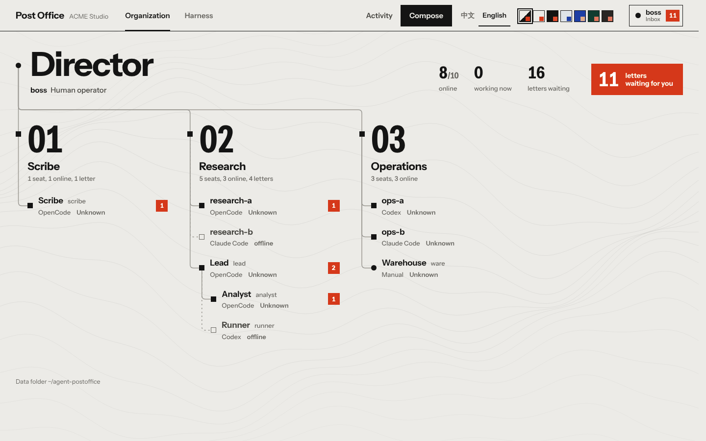
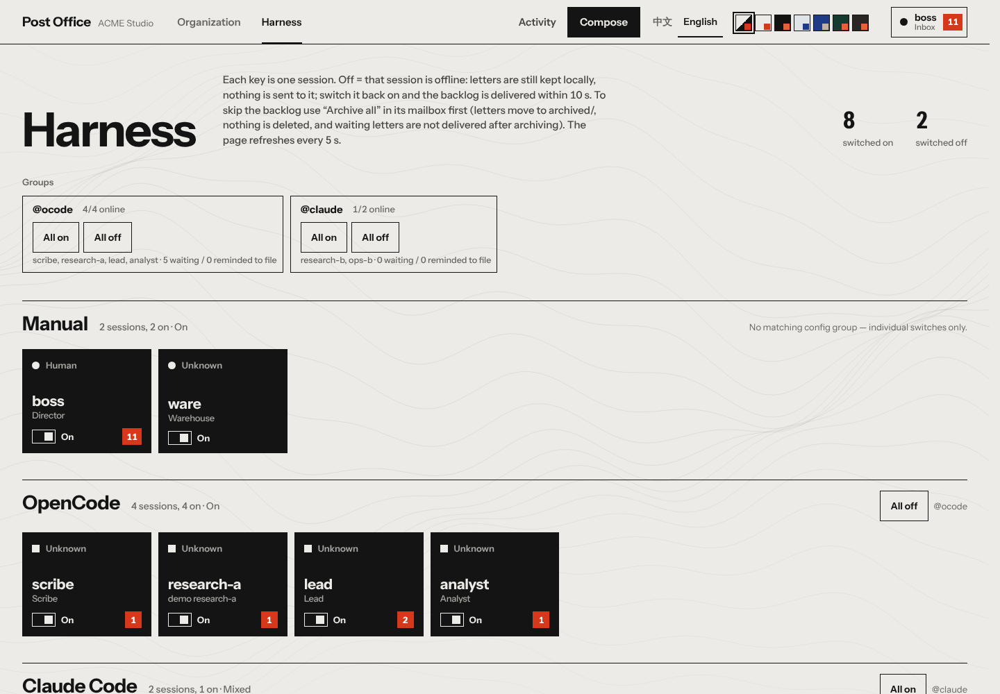
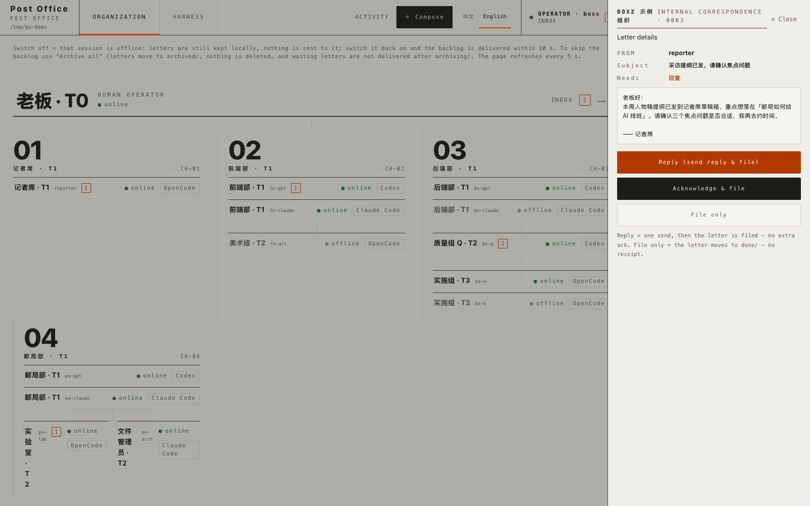
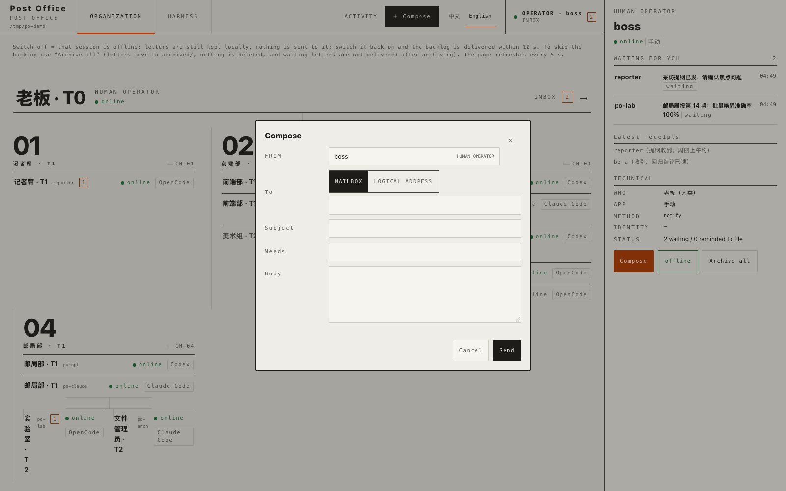

# agent-postoffice — a local post office for AI agent sessions

English · [中文](README.zh-CN.md)

> **How to read this document.** It describes the **current capabilities of the code on this
> branch** — nothing here is a promise about what is released, merged or running anywhere. Headings
> such as **v1.12** / **v1.13** only say *when a feature was introduced*; they say nothing about
> deployment status. The **organization / identity** layer described further down (a `version: 2`
> `config.json` with `organization`, `postoffice identity` / `rebind`) is **optional and off by
> default**: no `config.json` means no organization, and every other mailbox behaves exactly as
> before. Older-version notes and past release records live in `docs/` — reference material, not
> current instructions. To find out what a given machine actually runs, ask that machine:
> `postoffice --version`. A checkout on disk is not a deployment.

## Tired of being the messenger between AI agents?

**Start an AI company on your own computer.** Let **Claude Code (including Claude Desktop)**, **OpenCode** and **Codex** collaborate on one machine through **letters, receipts, logical roles and handover**: you define the goals, team rules and key calls; the post office handles **contact and handover**.

**Fastest entry**: copy the prompt below to any one of your agents and let it install the post office and stand up your own AI team (developers and troubleshooters who want to do it by hand: see **Install** below).

```text
You are my on-machine agent. Please install and bring up agent-postoffice (a local post office
between AI agent sessions) on this computer, so my Claude Code / OpenCode / Codex sessions can
send each other letters, acknowledge receipts and collaborate by role.
Do it by these steps, and: do not build a new installer, do not overwrite config unrelated to this
task, and do not collect or upload any secrets.

1. Check the current state: does ~/code/agent-postoffice or ~/agent-postoffice already exist, is
   `postoffice --version` available? Tell me the real state; do not reinstall blindly.
2. Read the current repo's install guide (README "Install / Register sessions / Daily use" and
   install.sh) and follow it for the harness I use (Claude Code / OpenCode / Codex).
3. Clone the repo and run install.sh (safe to re-run; it backs up before changing anything);
   tell me clearly if I need to restart an app.
4. Register my sessions: give them names, then `postoffice add <name> --claude|--opencode|--codex ...`,
   and check with `postoffice list` and `postoffice doctor`.
5. Verify send/receive: send a test letter to yourself or another session and confirm it wakes the
   recipient within 10 s, with receipts and filing working (10 s is the observed normal idle path;
   busy, offline or not-loaded sessions are not covered — a busy session is delivered when its turn
   ends, as measured in v1.14).
6. Report back briefly: what you installed, who you registered, the verification result, and what
   you need from me.
```

> **Honest boundary**: the post office only handles on-machine delivery, receipts, role routing and handover — it does **not** finish all your work for you and does not promise a "fully automatic company"; what each harness supports is exactly what this document and the current repo guide say.

Let **Claude Code (including Claude Desktop)**, **OpenCode** and **Codex** sessions on the same machine send each other mail, and **wake the recipient session automatically when a letter arrives**. No more copy-pasting between windows, and no AI driving the mouse to poke another app.

```
coder (OpenCode) ──writes a letter──▶ ~/agent-postoffice/boss/inbox/xxx.md
                                          │  within 10 s
                                          ▼
                   Claude session "boss" wakes up, reads, works, replies
```

- **Idle costs nothing**: waiting for mail is a tiny Python loop — no model calls, no tokens.
- **Never interrupts**: if the recipient is busy, the reminder waits until its current turn ends; drafts in the input box are untouched.
- **Delivered once**: each letter triggers one reminder, even across restarts; at most 6 wakes per mailbox per 10 minutes, so agents can't spam each other.
- **One wake per batch**: several ordinary letters landing together are delivered as a single reminder — a header plus one line per letter (stable reference, source, subject, real path) with the shared rules written once — so a pile-up can't burn a mailbox's wake budget or spam the session. More than 20 letters go out in rounds. Every letter still keeps its own delivery claim, ledger row and retry budget; a letter whose claim is taken by another OpenCode instance is skipped without blocking the rest of the batch; an alarm reminder always goes out alone.
- **Quiet-window batching, receipts only ride along**: a brand-new ordinary letter waits out a **quiet window** (45 s by default, `POSTOFFICE_QUIET`) before departing, so letters landing inside the window leave as one batch; the **active batching wait is capped at 150 s** (`POSTOFFICE_MAX_HOLD`) — a busy, offline or rate-limited recipient may see it delivered later; no guaranteed delivery time. **Receipts never wake anyone on their own**: a lone receipt is not delivered, starts no timer and takes no batch slot — it stays in `inbox/` and **rides along** only when a formal letter from the same mailbox departs; the same rules apply to **pure role/routing switch notices** (dual condition: system source `来源：postoffice` plus program header `切换事件：` — a peer-forged header never counts) — while the escalation variant (header `升级求助：`) is a real action ticket and wakes normally (merged into one trailing block with a bounded count; anything that does not fit waits for the next round). When a busy Codex session already has an updatable pending item, a new formal letter **joins it immediately** instead of waiting out the window. Alarms ignore the window and still go out alone. One judge decides wakes: the read-only `postoffice wake-plan <box>` command (a pure function shared by all three adapters — postman, the Claude hook and the OpenCode plugin; candidate JSON on stdin, malformed input is rejected).
- **Online / offline**: a session out of quota? `postoffice offline <name>` — letters are kept locally and not sent; `online` delivers the backlog; `clear` archives it instead (nothing is deleted).
- **Human mailboxes and stepwise escalation**: a human/owner joins as an ordinary mailbox (`postoffice add owner --notify --who "老板"`) — no owner type, no special channel, the same online/offline rules. An execution logical address lists only its **execution carriers** in `candidates`; while the first carrier is online, new letters go to it, and only an **offline** carrier hands the letter to the next carrier. When every carrier is offline the letter escalates **one level** to the role named by the optional `escalation_role` (e.g. `backend.q: {candidates:["q"], escalation_role:"backend.design"}`), which then resolves through its OWN candidates — you do **not** flatten the whole org chart into one candidate list, and the escalation acceptor never takes over the original role. If everything (the human included) is offline the send fails with the usual “no online mailbox” refusal rather than forcing a delivery. The alias resolves once, at send time: letters already delivered never move, so a later target change cannot reroute them. Switch announcements, per-recipient broadcasts, handover notes and their crash-resume dedup are the existing v1.7 alias machinery, unchanged — the whole ladder is pure config.
- **Post office only**: agents should talk only through the post office, never call `codex queue` directly — messages that bypass it ignore the offline switch, pile up while the recipient has no quota, and all pop out when it comes back.
- **A letter you regret can still be pulled back — or fixed in place**: `postoffice edit --box <sender box> <recipient box>/<letter ID> [--subject …|--need …|--body …]` rewrites a plain `send` letter **in place** (at least one field; the ID, file name, source and recipient never change, and the recipient only ever sees the new version — a scripted or in-flight delivery shows old text), while `postoffice retract <sender box> <recipient box> <full letter ID>` pulls it back. Both only work while the recipient's channel has not accepted the letter. The ID must be exact (no paths, globs or prefixes), the letter must still sit in that mailbox's `inbox/`, and its 来源 must match the sender box you name. Receipt notifications, broadcast copies, handover notes and alarm letters are refused — they belong to whoever asked for them. Every channel is judged by **its own** record of accepting the letter — the delivery claim, the plugin ledger, `.seen`, `.woken.json` — and a channel we cannot verify fails closed, so we would rather refuse than claim an edit or retraction that no longer matches what the recipient saw. A successful edit rewrites only those fields and keeps the file where it is; a successful retraction moves the letter as-is into `archived/`: the body is unchanged, no notice is written, nobody is woken, and **no correction is sent for you**; once delivered or in flight both refuse and leave it to you to send a correction. Edit/retraction and delivery race for the **same delivery claim**: whoever wins, the loser refuses, so you never get "updated successfully" next to an already-woken recipient, and a failed retraction hands the claim back rather than leaving a lock nobody holds. Delivery only wakes a session **after** it has taken that claim.
- **Receipts default to no reply**: `postoffice ack` records a receipt (and files the letter into `done/`) with a short metadata-only notification through the existing idle delivery channel — source, original subject and one lookup command, never the receipt body. A single receipt is at most three lines; several receipts landing in one wake are merged into one trailing "N receipts" block, with formal letters always first, and **receipts alone never wake**: a receipt that arrives by itself stays in `inbox/` until the next formal letter carries it along. Read the body only when needed with `postoffice receipt <box> <id>`, and file the notification with `postoffice archive-receipt <box> <id>`. A broadcast becomes one summary: `broadcast` sends each recipient a letter tagged with an ID, they `ack` it, and when everyone has replied (or the deadline passes) the sender gets exactly one summary letter (per-person notes are looked up on demand).
- **Control panel**: `postoffice panel` opens a local web page with one switch per session to cut or restore its connection, plus broadcast progress and the recent delivery log. Each mailbox shows **waiting / reminded-to-file / delivery-failed** counts taken from the same per-letter snapshot as the list (waiting = nothing sent yet, reminded-to-file = the channel accepted the reminder but the letter is still in `inbox/`, failed = that channel gave up and a human has to look). No new state store: reminded comes from the Claude `.seen` file, the plugin's `DELIVERED` rows or the postman's accept records — never from the 20-minute fallback marks, and `FAILED_FINAL` counts as failed, not delivered. The archive button's confirmation lists the total and all three counts (waiting + reminded-but-not-filed + failed delivery needing a human), says it archives **everything** in the inbox while keeping the files under `archived/`, and spells out that waiting letters will not be re-delivered afterwards and failed ones are archived without retrying. The page follows your browser language (Chinese for `zh*`, English otherwise) and has a visible 中文 / English switch that only redraws: it never changes a status, never calls a write endpoint and never wakes a session. Mailbox names, letter subjects, receipt bodies, handover paths and raw log lines are always shown verbatim in the original wording. Clicking a pending letter opens its full text (source, subject, needs and body — escaped, verbatim, never translated, so `<script>` stays text) together with a **File only** button that files exactly that one letter `inbox/ → done/` and leaves every other letter alone (already filed is an idempotent success; a same-named file already in `done/` fails closed and touches neither copy). Reading and per-letter filing (GET `/api/letter`, POST `/api/archive-one`) are generic — they work for every mailbox, the human one included — and both are deliberately different from the archive button's management sweep into `archived/`: the read endpoint is a pure read (no claims, no presented set, no ledger, no wake). POST `/api/ack-one` records a receipt through the same core as `postoffice ack` (idempotent — a repeat never writes a second receipt; the sender still gets the usual receipt notification and the original letter is filed), and POST `/api/send` writes an ordinary letter through the same core as `postoffice send` (ordered `@alias` candidates resolve once at send time, all-offline is refused with the same text, and the response carries `{id, ref}`; there is deliberately no reply/thread model — a reply is just a `send` with the recipient and subject prefilled). The v1.12 **Human Console** (next section) builds the Organization / Harness views and the operator's compose / reply / ack workflow on top of exactly these seams.
- **Fallbacks**: if a session can't be woken (not open), you get one system notification after 20 minutes — the clock starts from the later of when the letter landed and when that mailbox last came online (`online_since`, reset only on a real offline→online transition and seeded at the postman's first run after an upgrade), so offline time never counts. If a reminder went out but a letter that *needs action* is still in the inbox after 30 minutes (session stuck, Codex thread not loaded…), you get one too. Classification: receipt notifications and broadcast summaries never nag; an exact `need: 回复`/`审核` does, an exact `仅告知` doesn't; free text with only positive words (reply/review/handle/change/decide/confirm) nags, only negative words (FYI / no-reply / no action needed) doesn't, and mixed or unrecognized text still nags — we don't claim zero false positives.
- Pure standard-library Python 3.9+, no dependencies. macOS first (Linux works: notifications via `notify-send`, and you keep the postman running yourself).

## Install

```bash
git clone https://github.com/Atomheart-Father/agent-postoffice.git ~/code/agent-postoffice
~/code/agent-postoffice/install.sh
```

The installer (safe to re-run; every config file it touches is backed up to `~/agent-postoffice/logs/` first):

1. creates the post office at `~/agent-postoffice/` and links the command to `~/.local/bin/postoffice`;
2. adds three Claude Code hooks (`Stop`, `SessionStart` and `UserPromptSubmit` in `~/.claude/settings.json`, `asyncRewake`; `SessionStart` also prints a short identity hint, `UserPromptSubmit` records "working" for the panel's activity badge);
3. installs a global OpenCode plugin (`~/.config/opencode/plugins/postoffice.ts`) and lets OpenCode read/write the post office directory;
4. installs the `postoffice` skill into `~/.claude/skills` and `~/.agents/skills` (Codex and OpenCode read these too), so every agent knows how to use it;
5. on macOS, starts the postman at login (launchd).

Then **restart Claude Desktop and OpenCode**.

## Register sessions

First give each session a name in its app (Claude: rename the session; OpenCode: the session title), then register:

```bash
postoffice add boss   --claude   "Boss"       --who "plans and assigns work"
postoffice add coder  --opencode "Coder"      --who "implementation"
postoffice add review --codex    <thread-id>  --who "review"
postoffice add me     --notify                --who "me: notifications only"
postoffice list      # address book: who is who, online/offline, backlog
postoffice doctor    # health check
```

Claude sessions are identified by a **stable identity**: the desktop app sets `CLAUDE_CODE_HOST_SESSION_ID` (`local_…`) on the session process and the hook inherits it, so renames and rewinds no longer lose mail. If it is absent, the hook looks the payload's CLI session id up in `~/Library/Logs/Claude/main*.log` (newest in-line timestamp wins); a CLI-based Claude (`CLAUDE_CODE_ENTRYPOINT` not `claude-desktop`) uses its own CLI session id. The first title match binds the identity automatically, and a *different* identity with the same title never takes over. Set it by hand with `postoffice add boss --claude "Boss" --claude-session <id>`; `postoffice doctor` shows each Claude mailbox's binding. OpenCode accepts a title or a `ses_...` ID. Ask Codex for its thread ID.

## Everyday use

Just tell any session: "use the postoffice skill to send coder a letter asking it to …". It will run:

```bash
postoffice send coder boss "one-line subject" "回复" <<'MSG'   # need: 回复 (reply) / 审核 (review) / 仅告知 (FYI), the recognised values are Chinese
Key points. Put long content in a project file and give the path here.
MSG
```

The recipient wakes up, reads, does the work, replies, and files the letter into its own `done/`. An OpenCode session can do that last step with the `postoffice_archive_current` tool, which files exactly the letters that session was actually shown — letters that arrived afterwards are never touched; every other agent can use `postoffice archive-current --box <box> [--keep <ID> …]`. A single leftover letter (for example after a session rebind) can be filed by its exact ID with the `postoffice_archive` tool or `postoffice archive <box> <id>`.

**Receipt rule (copy that / ack)**: a letter you must answer before you can continue ("need: reply / review") still gets a proper `send` back. For "FYI" letters and the closing copy that, use `ack` instead: it records the receipt and files the letter into `done/`, with a short metadata-only notification (source, original subject, one lookup command) through the existing idle delivery channel — the body stays in the ledger. A single receipt is at most three lines; several receipts in one wake are merged into one trailing list after the formal letters. A receipt notification defaults to no reply and no further ack: read it, file it with `postoffice archive-receipt <box> <id>` (exact ID, idempotent; it never reads the body, sends, or wakes), and only follow up with `send` when an omitted part of the original request is needed to continue. `send` prints the **letter ID** (the file name minus `.md`), which is what `ack` takes. A broadcast (`broadcast`) sends one tagged letter per recipient; they ack the broadcast ID, and the sender gets **one** summary once everyone has replied or the deadline passes. To read a receipt body, run `postoffice receipt <box> <id>` (exact ID; read-only — no send, no ack, no moving letters, no waking; an unknown ID or another mailbox's receipt is refused).

| Command | What it does |
|---|---|
| `postoffice panel [--port 8765] [--no-open]` | Open the web control panel ([guide](docs/PANEL_GUIDE.md); listens on 127.0.0.1 only), including broadcast progress, group switches and where each logical address resolves |
| `postoffice config import ./postoffice-config.json` | Install `config.json`: groups + logical addresses (validates first, backs up the old file, atomic whole-file replace — no merge) |
| `postoffice config show` | Read-only: groups, logical addresses, who each one resolves to right now (creates nothing) |
| `postoffice offline @codex` / `online @codex` / `clear @codex` | Switch a whole group at once (`@` + group name); validates every member first, then reuses the single-mailbox rules |
| `postoffice send @project.manager me "subject" "need" ` | Send to a logical address: the first online candidate is picked **at send time** and the resolution is printed; if nobody is online it fails and lists the candidates (nothing is dropped into a candidate inbox) |
| `postoffice ack boss 20261004-223334_coder_hello "one line"` | Record a receipt: file the letter into `done/`, notify the sender when idle. For a letter the notification is sent anyway, so `--wake` only changes the subject to `copy that`; for a broadcast (which otherwise sends no per-recipient notification) `--wake` sends one extra `copy that` notification |
| `postoffice receipt boss 20261004-223334_coder_hello` | Read a receipt body by exact ID (read-only; letter ID or broadcast ID); never wakes anyone |
| `postoffice archive-receipt boss 20261004-223334_coder_hello` | File this box's receipt notification for that exact ID into `done/` (idempotent; never reads the body, sends, or wakes) |
| `postoffice retract boss coder 20261004-223334_coder_hello` | Pull back one ordinary letter the recipient's channel has not accepted yet: filed as-is into `archived/` (body untouched, no notice, no correction sent for you; refused once delivered or in flight) |
| `postoffice edit --box boss coder/20261004-223334_coder_hello --subject "fixed" --need "reply" --body "corrected text"` | Rewrite one ordinary letter the recipient's channel has not accepted yet, **in place** (at least one of `--subject` / `--need` / `--body`; ID, file name, source and recipient unchanged; nothing is re-sent, refused once delivered or in flight) |
| `postoffice archive-current --box boss --keep 20261004-223334_coder_hello` | File the letters this box has already been shown into `done/` — it never scans the inbox, so later arrivals are untouched; `--keep` leaves the named IDs in place. Prints the real filed / kept / cleaned-up counts |
| `postoffice archive boss 20261004-223334_coder_hello` | File **one** exact ID from this box's `inbox/` into its own `done/` (the successor's tool after a rebind). Idempotent, never overwrites an existing `done/` file, rejects paths / globs / cross-box IDs; filing only — no ack, reply, send or wake |
| `postoffice broadcast all boss "subject" "need"` | Send every other mailbox a tagged letter; `--deadline 30m`; acks are summarized into one letter to you |
| `postoffice offline codex1` | Recipient out of quota / away: letters are kept, no reminders |
| `postoffice online codex1` | Back: the backlog is delivered within 10 s |
| `postoffice clear codex1` | Clear backlog: archive unsent letters to `archived/`, never send them (same button in the panel) |
| `postoffice remove coder` | Remove from the address book |
| `postoffice postman` | Run the postman in the foreground (if you don't want it at login) |
| `postoffice uninstall claude` / `postman` | Remove the hooks / the login item |

## Human Console: Organization, Harness, and the operator's inbox (optional, v1.12)

`postoffice panel` is a **Human Control Surface** on top of the same data files — never a second post office. How to use, tune and maintain the page is in [docs/PANEL_GUIDE.md](docs/PANEL_GUIDE.md) (中文：[PANEL_GUIDE.zh-CN.md](docs/PANEL_GUIDE.zh-CN.md)); its look is recorded in [DESIGN.md](DESIGN.md):

- **Organization** renders the optional `panel` section of `config.json`: a presentation-only tree of `mailbox` / `members` (peer pair) nodes with `label` and `children`. It is pure decoration over the truth files — a broken `panel` section shows an error **only in this view**, while physical sends, `@alias` routing, groups, the postman, Harness and every mailbox keep working untouched, and `routes.json` stays byte-identical. (BOXZ in the examples is just example data; any project can describe its own tree, and an ACME-shaped tree works identically.)
- **UNASSIGNED**: every registered mailbox the organization tree does **not** place is still listed, in an automatic 未编入组织 / "Not in the organization" area — nothing can be hidden by leaving it out of the tree. Display-only: the office never edits `config.json`, never guesses a department from names or harness, the mailbox keeps its inspector, deliveries and online/offline switch, and once you add it to the tree it appears at its formal place instead. Every mailbox appears at most once.
- **Harness** groups sessions by the real `method` in `routes.json` (claude_hook / opencode_plugin / codex_queue / notify) with live On / Off / Mixed states, derived on every render and never stored. A group ON/OFF control appears only when a configured `groups` entry matches a rack's member set **exactly**; otherwise every session keeps its own switch. No group engine is re-implemented here — the buttons call the same status endpoint.
- **Human operator**: `panel.operator` names one mailbox (typically the human's `--notify` box). The big "letters waiting for you" button on the Organization page (or the operator button, top right, or any seat) opens the inbox **popup** on every screen size (Esc, the Close button or a click outside closes it; the page behind is locked and inert): pending 需要列表 → recent acks → technical metadata. With an invalid operator everything stays readable, but compose/reply/ack are disabled with an explanation.
- **Write / reply / acknowledge / file**: ＋写信 composes from the operator (recipient = a mailbox or an `@logical address`; groups are refused). 回复 prefills the canonical sender and a `Re:` subject, sends through `/api/send`, then files the original letter — a formal reply is **never** also an `ack` (the sender would receive two copies). If the send succeeds but filing fails, the page says so and offers retry-filing only (never a second send; the sent-replies memo lives in the page session only). 收到并归档 records a receipt through `/api/ack-one` (recorded / already / receipt-notice states); 仅归档 files without a receipt through `/api/archive-one`. Opening a letter is a pure read with zero side effects.
- **Deep links**: `#/mail/<box>` opens a mailbox's workbench; `#/mail/<box>/<id>` opens one letter. A link is consumed once (the hash is cleared via `history.replaceState`): closing stays closed, the 5-second refresh never re-opens it, and browser Back does not replay a consumed link. An invalid link reports once.
- **Remote access (optional)**: the panel still binds `127.0.0.1` only. Set `POSTOFFICE_PANEL_BASE_URL=https://host.ts.net` to get deep links with that base and to allow that **one exact** origin for write endpoints — no wildcards, no suffix matching, no `X-Forwarded-Host`, and a malformed value refuses to start the panel. The intended tunnel is `tailscale serve` (see Tailscale docs); plain localhost keeps working with or without it.
- **Slack operator alert (optional, outbound-only)**: with `POSTOFFICE_SLACK_WEBHOOK` set, a confirmed delivery into the operator mailbox also posts a short Slack alert (sender, 事由, 需要, and a deep link — never the body; several letters in one round become one "N 封" message with the inbox link). The same webhook also mirrors the **grace-timeout** popup: a letter to a hook/plugin mailbox still unconfirmed after the 20-minute grace period posts a short alert (mailbox, 事由, deep link — never the body), worded as "未确认成功唤醒/投递" because there is no read receipt; it rides the same one-shot timeout mark, so it is never re-sent. Best effort with a ~3 s timeout: a slow, failing or hanging webhook never changes what was delivered, never retries, and at worst delays the round briefly. The webhook URL is a secret: environment variable only, never written into `config.json`, `routes.json`, state files, HTML, logs or this repo. Nothing inbound — Slack can not send letters.
- **Private runtime settings (optional): `$POSTOFFICE_HOME/.env`** — the postman/panel started by launchd do not inherit your shell exports, so this tiny stdlib file (read at startup; `POSTOFFICE_*` keys only; no shell syntax, no variable expansion; a real process env value always wins over `.env`; malformed lines are skipped with a value-free note) is where to keep them. Example with fake values: `POSTOFFICE_SLACK_WEBHOOK=https://hooks.slack.com/services/T000/B000/XXXX` and `POSTOFFICE_PANEL_BASE_URL=https://machine.example.ts.net`. Run `chmod 600` on it; it lives in your local home, is **not** part of this repo, and is never written into `routes.json`/`config.json`, state, HTML or logs. Restart the postman/panel after editing it.

### v1.13: outbox, runtime presence, appearance, mobile

- **Outbox — operational, not a permanent Sent history**: the inbox popup has an Inbox | Outbox tab pair. Outbox lists the operator's letters that are **still observable**: it is a read model derived at request time (GET `/api/outbox`) by scanning every registered mailbox's `inbox/` for ordinary direct letters whose 来源 is the operator — receipt / broadcast / alarm / switch notices and anything from `postoffice` are excluded. Nothing is copied and nothing is stored: archiving, delivery or ack makes a row disappear, so it is a snapshot of what can still be acted on, never a durable log of everything ever sent. Each row shows the frozen recipient, subject and need, the `逻辑地址：` header exactly as written at send time (never re-resolved), and a status: **pending** (still editable / retractable) or **locked / unknown** with a Chinese reason (already accepted by the channel, in flight, or an unknown channel) and no action buttons. 改 / 撤回 go through POST `/api/edit-one` and POST `/api/retract-one`, which share the exact CLI `edit` / `retract` core: the sender is always `panel.operator` (any `from` / `sender` in the request is ignored), the letter is re-claimed and re-checked at POST time so a row that looked pending can still lose the race and fail closed, edit rewrites subject/need/body in place (id, sender and recipient unchanged), and retract moves the original to `archived/` with no notification and no second letter.
- **Runtime presence — presentation only**: every mailbox carries an activity badge — 运行中 / Working, 空闲 / Idle or 未知 / Unknown (a person's own box shows 人类 / Human) plus a duration (e.g. `· 17m`, `· 4h 12m`) — in the org tree, the Harness racks and the workbench. The signal lives in `$POSTOFFICE_HOME/runtime/activity/<box>.json` (`{state, since, observed, source, binding}`), written best-effort by the OpenCode plugin (session busy/idle) and by the Claude `UserPromptSubmit` hook (`postoffice activity --state working`), and is **never** part of routing: delete the whole `runtime/` directory and delivery is unchanged. A state is shown only when the recorded channel binding still matches the mailbox's current session identity and the observation is younger than 30 minutes; otherwise it is UNKNOWN. The human operator is always 人类 / HUMAN, never a fake IDLE.
- **Appearance**: six small swatches in the top bar — Paper, Night, Mist, Blueprint, Pine, Ember. No "follow the system": the palette you pick is the one you keep, across a reload and when arriving from a Slack link. Each palette is a block of the same colour roles; the accent colour only ever means "a letter is waiting". The choice is kept in `localStorage["postoffice.theme"]`, a tiny `<head>` bootstrap applies it before first paint (no light flash), and repainting (first load, language switch, poll) never writes — only your click does. A missing, legacy `system` or illegal value falls back to Paper; choices saved by older versions (`light` / `dark`) map to Paper / Night. Unavailable storage costs persistence, never the ability to switch. Note the palette is stored per origin: the panel prints one canonical entry (the public base URL when configured) so the same choice is in effect there and in Slack links; a different browser or a private window has its own copy. It only redraws — no write endpoint, no language change.
- **Mobile / iPad**: the inbox popup is closed until opened (on every width), goes full screen at ≤900px, and the Outbox tab is reachable; layout uses `env(safe-area-inset-*)`, `100dvh` and ≥16px form controls so iOS does not zoom, and no fixed panel is wider than the viewport (the popup becomes `width:100vw` at ≤900px).
- **Provenance**: a letter's header states the source mailbox neutrally — `来源：<sender>（邮局只确认来源信箱；该来源的身份与权限按当前项目的组织/角色约定处理。）` — and the wake text carries the same `来源：<sender>`. The transport no longer asserts whether the sender is human or an agent; that is left to the project's own organisation/role conventions.

The console at a glance (ACME demo data, 1440×900, English UI; the inbox is a popup, the letter docks over its reading pane):

| Organization view (a tree drawn from `panel.organization`) | Harness (one key per session, grouped by the real method) |
|---|---|
|  |  |
| **Inbox popup with a letter** (reading is a pure read; reply / acknowledge / file) | **Compose** (as the operator; mailbox vs logical address) |
|  |  |

## Organization & identity (optional, v2 config)

> What this layer does and does not enforce (it is a cooperative system, not an access policy), and what the human can and cannot control: [docs/GOVERNANCE.zh-CN.md](docs/GOVERNANCE.zh-CN.md) (中文).

Dynamic routing can change who serves an address, but a fixed note or an old handoff still says the
old owner is on duty. This optional layer turns "who is responsible for what" into a **single
queryable fact**. It adds no database, daemon, second routing table, or current-owner cache; physical
mail, ordinary delivery and logical-address switching are unchanged.

- Add an optional `organization` section to `config.json` with `version: 2`:
  companies (name + `rules_file` + members) and projects (`company_id` + `root` + `status_file` +
  members). A name in any list must be a registered physical mailbox, and a project member must
  belong to the owning company — the whole file is validated and rejected atomically on import, so a
  bad reference never overwrites a working config. A **role** is an alias carrying
  `role: {scope: {kind, id}, title}`; the ordered candidates stay only in the alias, so there is no
  second assignment table. Old version-1 configs (and aliases with no `role`) keep working unchanged.
- `postoffice identity <mailbox> [--json]` prints the derived snapshot: current binding, company /
  project memberships, **ACTIVE** roles (the address actually resolves to this box right now, via the
  same resolver `send` uses), **CANDIDATE ONLY** roles (may take over when it is their turn — not a
  current duty), and pointers to the company rules / project STATUS files. A query is a snapshot; a
  later send still re-resolves against current routes.
- Registration is split: `postoffice add <box> --display-name/--kind/--desc` on an existing box only
  updates its profile (never rebinds or resets the receive method); an explicit receive-method flag
  (`--claude` / `--opencode` / `--codex` / `--notify`) triggers a **rebind** and records a handoff line
  in `logs/rebind.log` (`postoffice rebind` is the explicit entry point). Profile fields are data, with
  one deliberate exception: an explicit `--kind human|agent|unspecified` **does** change the recorded
  category. `--display-name` / `--desc` (and the legacy `--who`) change neither category, org
  relations, role, binding nor delivery.
- The contact card (`<box>/CONTACT.md`), the panel `/api/state` box rows and the shared skill all
  present **the same** derived identity rather than assembling duties independently; the card keeps a
  query entry and no longer copies a live online/current-owner status or a direct session-queue hint.
  When the organization config is invalid the identity presentation is diagnosably disabled
  ("已停用") while physical mail keeps working, and no duties are fabricated.

Migration and rollback are one step each (edit `version`/add `organization`, import; restore
`logs/config.json.<ts>.bak`): see [docs/ORG_IDENTITY_V1.md](docs/ORG_IDENTITY_V1.md).

## A session setting its own alarm (OpenCode, optional)

Two native tools let a model in an OpenCode session set a one-shot reminder **for that very session**:

| Tool | Arguments | What it does |
|---|---|---|
| `postoffice_alarm_schedule` | `delay_minutes` (integer, 1–1440) | rings once, that many minutes from now |
| `postoffice_alarm_cancel` | none | cancels this session's pending alarm |

One sentence is enough: "set a 25-minute alarm to remind me to check the build".

**End the turn as soon as it is set.** An alarm is not a wait: the tool returns immediately and tells the model to end the turn — no sleeping, no polling, no busy-looping. Whatever you lined up keeps running on its own in the background; the post office neither starts it, watches it, nor has any opinion on whether it finished.

When it fires the action is deliberately narrow: the resident postman queues one fixed sentence into **the same physical mailbox** (`你设的闹钟到了，请检查刚才安排的任务。`) and reuses the existing OpenCode idle delivery channel to put that one sentence into the session. A busy session is left alone until it goes idle — no interruption, no nagging. If the route is offline or the session is not loaded the letter simply waits and is delivered at most once after that; neither a postman nor an OpenCode restart loses it or makes it ring twice. **Only the currently bound session is woken**: nothing opens files for you, nothing runs the next step, and nothing claims the experiment is done — that judgement is still yours, or the model's in that session.

Identity is resolved by lookup, never supplied: the tool reads the session ID OpenCode hands it and looks for the single mailbox that both uses the OpenCode plugin channel and is bound to that session. No match, several matches, an offline mailbox, or a session that cannot be confirmed as belonging to this instance all mean refusal with nothing written to disk. The CLI-side scheduler re-checks the record a second time (is the mailbox still registered, does it still use the channel, is `session_id` still the same, does OpenCode actually know this session) and refuses anything that no longer matches. The tools take no recipient, mailbox or free-form body, so a model cannot use them to post into someone else's inbox.

One alarm per session at a time: setting a second one fails with a clear "cancel it first" instead of silently resetting the first. Once it has rung you do not have to clean up — the runtime record retires itself.

- Upper bound 1440 minutes (24 h): this is a "come back and look at this later" reminder, not a calendar. For anything longer, start another conversation instead.
- Lower bound 1 minute: waiting less than that is not worth it — just keep working.
- The timers live in `<POSTOFFICE_HOME>/alarms/` as **runtime** data (one 0600 JSON file per session holding only the alarm id, mailbox, session, due time and delivery state). It is not user configuration, has no import UI, and never stores the task text you gave it.
- **OpenCode only** in this version. Claude and Codex sessions have neither tool, and the post office does not claim to support them.
- Accuracy: the postman polls every 10 s, so the alarm can be up to about 10 s late; the due time uses the machine's wall clock, and NTP steps do not matter for delays of a minute or more.

The lock lives on the post office side and it is a kernel `flock`: one `<alarms>/<session>.json.lock` per session, held across set, cancel and firing, and the lock file is created once and never removed — so neither "a reaper deletes somebody else's fresh lock" nor "a holder that was paused for a long time comes back and deletes the new one" can happen, and a holder that is killed or whose machine reboots releases it by itself. Only Python writes records (Node has no flock API); the plugin's job is to work out which mailbox the session belongs to. This needs `POSTOFFICE_HOME` on a **local filesystem** — flock over NFS is not reliable.

Old/new side by side: the lock path is `<alarms>/<session>.json.lock`, and the **old version used the same path plus `.gate` / `.reap` files with mtime leases**. On upgrade those files are simply left there; the new version neither reads nor deletes them, so nothing needs cleaning. But **an old and a new version running against the same `POSTOFFICE_HOME` do not exclude each other** (the old one guards `.gate`, the new one flocks the same `.lock`, two protocols minding their own business), so stop the old postman before starting the new one in the upgrade window, and the same in reverse.

## Editing and filing mail from an OpenCode session (optional)

Three more native tools let an OpenCode model fix or file its own mail without shell access:

| Tool | Arguments | What it does |
|---|---|---|
| `postoffice_message_edit` | `message_ref` (`<recipient box>/<letter ID>`), `content` (object with at least one of `subject` / `need` / `body`, or `null` to revoke) | Exactly the CLI `edit` / `retract` rules: only a plain letter this session sent, only while the recipient's channel has not accepted it; a delivered or in-flight letter is refused with a clear message, and the model is expected to send a correction instead |
| `postoffice_archive_current` | `keep_unarchived` (optional list of letter IDs) | Files the letters this session has actually been **shown** into `done/` — the presented set, not the whole inbox: letters that arrived after the last wake are never touched, and the listed IDs stay in the inbox. Reports the real filed / kept / cleaned-up counts, and never reports a failure as success |
| `postoffice_archive` | `letter_id` (one exact bare letter ID) | The successor's tool after a rebind: files **one** exact ID from this box's `inbox/` into its own `done/` (the same core as `postoffice archive <box> <id>`). Idempotent, never overwrites an existing `done/` file, rejects paths / globs / cross-box IDs; it is filing, not answering — no ack, reply, send or wake |

Identity is resolved, never supplied: the tool reads the session ID OpenCode hands the plugin and looks for the single mailbox bound to that session; no match, several matches or a mailbox that cannot be confirmed as this instance's mean refusal with nothing written. The real work runs through the CLI under the same claims and locks as everything else — the plugin never edits a letter itself.

## Groups and logical addresses (optional)

Without `~/agent-postoffice/config.json` none of this exists and everything else behaves exactly as before. Import a config and you get two things:

```json
{
  "version": 1,
  "groups": { "codex": ["manager_a", "reviewer_a"] },
  "aliases": {
    "project.manager": { "candidates": ["manager_a", "manager_b"],
                         "notify": ["coordinator_a"],
                         "handoff": "/path/to/handoff.md" }
  }
}
```

- **Groups** are just names for existing mailboxes: `offline @codex` / `online @codex` / `clear @codex` reuse the single-mailbox behaviour (no group runtime state, the mailbox status stays the only truth), and the panel gets a small Groups area with an all-on / all-off button through the same status endpoint and local-origin check.
- **Logical addresses** let a sender write `send @project.manager …` instead of hard-coding a manager. The alias picks the first online candidate when `send` runs. Letters already delivered are never moved or re-routed; a pending switch never delays a new letter.
- **Switch announcements**: once a new target has been stable for 60 s (`POSTOFFICE_ALIAS_STABLE` shortens it in tests) the postman confirms the switch once — one regular broadcast to the `notify` boxes (acks are tallied as usual), one `need: FYI` handover note to the new target carrying the handoff *path* (the post office never reads that file), a `logs/alias_switch.log` line with event id, before/after, reason, notify boxes and handover target, plus one system notification. The first sighting only records a baseline (no broadcast) — including when *no* candidate is online, which still waits out the same 60 s before the single "nobody took over" notice instead of firing at startup. A flap inside the stability window is cancelled silently, and a restart keeps the baseline and the de-duplication record. With no online candidate only `notify` and you are told — nothing is dropped into a candidate inbox. Broadcast and handover are de-duplicated per step, so a failed handover resumes without re-broadcasting. The handover note carries the same kind of recoverable event identity, so even a hard interrupt between "the note landed" and "the state write" resumes the remaining step instead of sending a second note.
- One switch, one broadcast id, one letter per recipient: after a partial failure the resume only reaches the boxes that never got one, and even if the state did not reach disk the post office looks the letter up in the box itself — in the inbox, in the `done/` the recipient filed it in, and in the `archived/` tree `clear` moved it to — instead of re-delivering or opening a second broadcast record. Archiving an old broadcast yourself therefore never makes it re-announced. The id comes from a counter in the state file that only ever goes up, not from the clock, so two logical addresses confirmed in the same second cannot collide and re-adding a deleted alias cannot reuse an old id. Removing an alias from the config drops its baseline right away, so re-adding it starts from a fresh baseline instead of resuming a switch that was never confirmed.
- Import refuses anything it cannot honour: an unknown mailbox, a name that is both a group and an alias, nesting, duplicate members/candidates/notify targets, names with paths, spaces or globs, and duplicate JSON keys. A refused import leaves the old file byte-identical. The same checks run again every time the config is used, not only at import, and they come in two tiers. A **core** config error (bad JSON, duplicate keys, unknown version, a malformed group or alias) disables groups *and* logical addresses together with an explanation, while physical mailboxes keep working and no mailbox status is touched on the way out. If only the **organization** section is broken while groups and aliases are valid, those keep routing normally and only the organization identity presentation is switched off (it then reports "已停用" plus the reason) — a broken organization never takes legal `@alias` delivery down with it. `postoffice config show` still lists every problem.
- These notes only report a routing change. They grant nobody extra permission, start no work, and are not a new authorisation from the human.

## How it works

| Recipient | Who wakes it | How |
|---|---|---|
| Claude Code | Claude Code's own hooks | At the end of every turn and when a session starts, a hook launches `postoffice hook` in the background; it waits without calling the model. On new mail it exits with code 2, and Claude Code hands the reminder to the session and wakes it. Command hooks default to a 600 s timeout (observed: killed after 10 minutes), so the installer sets an explicit 7-day `timeout` |
| OpenCode | Global plugin | Checks every 10 s and whenever a session goes idle; only when the session is idle does it send a reminder through OpenCode's own `session.promptAsync`. With several OpenCode instances open, claim files ensure a letter is delivered once; a failed delivery releases its claim and the retry re-claims, so two instances never each retry the same letter |
| Codex | Postman | `codex queue --thread <id>` queues a reminder in the thread |
| You | Postman | System notification |

Everything lives in `~/agent-postoffice/` (override with `POSTOFFICE_HOME`): `routes.json` is the single config; one directory per mailbox (`inbox/`, `done/`, `CONTACT.md`); logs in `logs/`. Set `POSTOFFICE_NO_NOTIFY=1` to keep system notifications off — the OpenCode plugin and the postman then only write a log line instead of popping one. The plugin always logs a `通知人：…` line to `logs/opencode_plugin.log` before it notifies; the postman writes to `logs/notify.log` when notifications are suppressed.

## What "delivered" means

The post office distinguishes three things:

- **Waiting**: nothing has been sent yet — the mailbox was offline, the session is busy, or the reminder is still queued.
- **Reminded**: the hook woke the Claude session / the plugin sent OpenCode a reminder / `codex queue` returned success. This only means the reminder went out.
- **Processed**: the recipient moved the letter into its `done/`.

A letter that was reminded but is still in `inbox/` is what the panel counts as "reminded, to file"; `FAILED_FINAL` from the plugin is shown as "delivery failed" instead, because nobody is going to act on it on its own. The archive confirmation lists all three counts and the total, says it archives **everything** in the inbox while keeping the files under `archived/`, and spells out that waiting letters will not be re-delivered afterwards.

If a letter that **needs action** (its `need:` header says reply / review / …) was reminded but not processed within 30 minutes, the postman notifies you once; FYI letters, receipt notifications and broadcast summaries are backlog only and never nag. Known case: when a Codex thread isn't loaded, `codex queue` still returns success but the thread won't resume on its own — this alert covers it.

## Verification status

This section corresponds to version **v1.14** (2026-10-08); the scope is the post-office capabilities described here. It has two parts: **actual use / automated verification** (main table) and the **real quota-exhaustion matrix** (separate table, not re-verified on a live provider).

| Item | Status |
|---|---|
| Send/receive, dedup, rate limit, online/offline, clear, ack bookkeeping, receipt lookup, broadcast summaries, install/uninstall, need-based alerts, stable Claude identity, merged receipts | automated checks in `tests/smoke.sh` |
| Config import validation, group switches, logical-address resolution and fallback, switch announcements (baseline / stable / cancelled flap / nobody / recovery / primary returns / resume after a failed handover), panel groups and buttons, ack by physical letter ID, archive-before-count | the same run of `tests/smoke.sh` (252 checks total, the v1.7 group runs in its own temp post office; mutants of every new rule were verified to fail these checks) |
| Panel per-letter status and counts (waiting / reminded-to-file / failed), the Chinese/English switch, verbatim escaped user content, confirmation wording covering both statistics | `tests/panel_i18n_test.mjs` (runs the real page script against a DOM stub: default by browser language, manual choice persisted, unusable storage still switchable, switching issues no write call, user content escaped and untranslated; six mutants verified to fail) plus the `tests/smoke.sh` API checks for the three statistics, `.delivered.json` fallbacks and `FAILED_FINAL` |
| The six regression negatives from the review round: full config validation at use time (wrong version / duplicated member / notify target removed all disable groups and logical addresses together with no change to routes or inboxes), a first sighting with nobody online that still waits out the window before one notice, an alias baseline that is really persisted when the alias is removed, one broadcast record per switch that is not replayed even when the delivered list is lost, an empty or malformed `广播:` header rejected without touching the ledger or the letter, and an archive confirmation listing failed deliveries plus the total | block 14 of the same `tests/smoke.sh` (60 assertions, each case in its own temp post office); eight mutants were tried, one of them swapping the whole event step back to the pre-fix implementation |
| The two blocking fixes: broadcast ids never collide (two logical addresses confirmed in the same second, with the same and with different notify targets, independent acks per broadcast, no cross-box ack), and resume after a real hard interrupt (the letter left in the inbox, filed into `done/`, and archived by `clear` — each run separately, and again for the handover note's own write-then-save window so it cannot be sent twice) | blocks 4b/4c/4d of the same `tests/smoke.sh` (12 more assertions); the interrupt case loads the real `postoffice` module in-process, lets the letter really land, then raises a `BaseException` (not caught by `except Exception`), reloads the module from disk and runs a second round, asserting the resume branch really executed |
| Session-set alarms end to end (tool entry, identity resolution, timer, minimal rendering, cancel, per-session locks, a lettered record that must name its own letter) | `tests/alarm_test.py` (46, including the flock races, takeover after kill -9 and pause recovery) and `tests/alarm_plugin_test.mjs` (47, against a mock OpenCode; records are written by Python under the lock and the plugin only resolves the mailbox) against a mock OpenCode; twenty mutants were tried across the review rounds. **Not run against a real model**: the model has never actually called these tools, and the fixed sentence has not been seen in a real OpenCode turn |
| Retracting or **editing in place** an ordinary letter per channel (delivered / in-flight refused, unknown channel fails closed, derived notices refused, only subject/need/body change and nothing re-sent, a retracted letter never wakes a session afterwards), and edit/retraction racing delivery for the same claim | `tests/retract_test.py` (35 checks, incl. six that really run the hook or the postman, and six rounds of two real processes racing), `tests/message_flow_test.py` (25 checks for the update/revoke rules, the batched wake text and archive-current's fail-closed paths) plus `tests/alarm_plugin_test.mjs` for the plugin side. One caveat: the plugin's post-claim re-check of the letter has no automated coverage — the window between claiming and that check cannot be produced from the harness |
| Panel letter detail API and single filing: full raw body round-trip (multiline / Chinese / English / emoji / HTML-like / `<script>`), traversal and glob id rejection, unknown box and missing letter, malformed box names fail closed even if `routes.json` was hand-edited, pure read (whole-home byte snapshot stays identical), `inbox → done` move, idempotent repeat, `done/` collision fails closed without touching either copy (same content included), panel guards kept, `/api/clear` still archives to `archived/` | `tests/panel_letter_test.py` (11 HTTP tests against a real `postoffice panel` in a temp home) |
| Single-letter receipt over HTTP (POST `/api/ack-one`): the same core as CLI `ack` (receipt ledger entry, original `inbox → done`, the sender's usual receipt notification with its query line), a duplicate call is idempotent and writes no second receipt, unknown box / unknown or malformed id fail closed without touching anything, malformed JSON / wrong Content-Type / bad Origin still rejected | `tests/panel_send_ack_test.py` (real panel in a temp home; also asserts the CLI `ack` runs through the same helper and produces the same ledger entry and notification) |
| Compose seam over HTTP (POST `/api/send`): physical target, `@alias` first-online resolution, an earlier online candidate is never skipped, fallback only when it is offline, all-offline refused with the existing “no online mailbox” text, old mail never moves after a target change, unknown sender / unregistered target refused, and the resulting letter is byte-identical to one written by CLI `send` | `tests/panel_send_ack_test.py` |
| The shared skill no longer teaches shell `mv` into `done/`: archiving goes through `postoffice_archive_current` (OpenCode) / `archive-current` (other harnesses) / the same core API (panel); the regression reads the skill file | block 16 of `tests/smoke.sh` plus code review (the skill also must stay org-agnostic — project-local config supplies the hierarchy) |
| Panel presentation config: optional `panel` section (label/operator/organization), node rules (mailbox XOR members, unknown fields, aliases rejected), whole-tree uniqueness, normalized shapes, absent/error/valid states — and **isolation**: with a deliberately broken `panel` section, physical send, `@alias`, group ops, a full postman round and `/api/state` all still work while `routes.json` stays byte-identical | `tests/panel_presentation_test.py` (11 tests; also a non-BOXZ ACME tree) |
| Panel base URL + Origin: malformed `POSTOFFICE_PANEL_BASE_URL` refuses to start, only the one exact origin is added, scheme/suffix/other-host probes are 403, localhost still allowed, still bound to 127.0.0.1 | `tests/panel_origin_test.py` (7 tests, real server in a temp home) |
| Slack operator alert: only operator + formal letters, deep link with base URL, batch shape, failure does not change delivery or re-alert, secret stays out of logs/state/HTML, unset → zero requests, hanging webhook does not stall the next mailbox | `tests/panel_slack_test.py` (10 tests against a local fake webhook) |
| Slack grace-timeout sync: hook/plugin letter unconfirmed after GRACE → one metadata-only Slack alert (mailbox, 事由, deep link, never the body) mirroring the desktop popup with the same one-shot mark; before GRACE / accepted / offline / alarm → zero requests; next round never repeats; notify path keeps its own wording; failure/slow webhook keeps bookkeeping and does not stall the next box; secret stays out of logs | `tests/slack_grace_test.py` (12 tests against a local fake webhook) |
| `.env` private runtime settings: fills missing `POSTOFFICE_*` keys, process env wins, comments/quotes/malformed handled without leaking values, no shell expansion/execution, launchd-style (only `POSTOFFICE_HOME`+`PATH`) still reads webhook/base URL, secret stays out of logs/state/HTML | `tests/env_file_test.py` (12 tests) |
| Human Console UI: generic org rendering (ACME), operator button and inbox popup, Harness racks + exact-match group control (partial overlap never shows), compose/reply full matrix (incl. send-OK + archive-fail → retry-filing only, never a second send, never ack), ack three states, file-only, pure read, deep-link one-shot lifecycle, not-in-the-organization section (render purity, no duplicate), operator-invalid disables writes | `tests/panel_console_ui_test.mjs` (DOM stub) and `tests/panel_org_render_test.mjs` (organizations the page has never seen, no-organization fallback, broken config, wire graph, popup contract) |
| Panel UI: click a pending row → detail shows the fetched (not inline) content escaped; File only sends exactly one `{box,id}` POST then closes and refreshes; read/archive failure messages; a language switch closes the detail without a write call (and cancels an in-flight read); the new strings exist in both languages | `tests/panel_letter_ui_test.mjs` plus the extended `tests/panel_i18n_test.mjs` |
| v1.13 OUTBOX: discovery only scans operator-authored ordinary direct mail (derived notices excluded), rows have the frozen shape, the `逻辑地址：` header is shown frozen (never re-resolved), status classes pending / locked / unknown with Chinese reasons and no action on locked/unknown, GET `/api/outbox` is a pure read, POST `/api/edit-one` and `/api/retract-one` are parity with the CLI core (in-place edit keeps id/sender/recipient; retract moves the original to `archived/` with nothing else written), spoofed `from`/`sender` ignored, bad requests touch nothing, and a claim held elsewhere makes the POST fail closed | `tests/outbox_test.py` (15 tests against a real `postoffice panel` in a temp home) |
| v1.13 runtime presence: `runtime/activity/<box>.json` schema, same state keeps `since` while a change resets it, a mismatched channel binding or an observation older than 30 min → UNKNOWN, deleting `runtime/` changes no routing, the Claude hook writes idle then working, and `/api/state` exposes `activity` per box | `tests/activity_test.py` and `tests/activity_plugin_test.mjs` (mock OpenCode client) |
| v1.13 provenance: the frozen neutral source header, the body byte-for-byte unchanged, the sender-neutral wake text (Claude and Codex paths), and a static audit that no sender-authority phrase remains in the skill / `postoffice` / plugin / panel | `tests/provenance_test.py` |
| Appearance + mobile: the six-palette control persists to `localStorage["postoffice.theme"]` and there is no System option, so a chosen palette survives reload, close-and-reopen on the same origin, a Slack-style deep link, a language switch and polling; repaint never writes (only a click does), so nothing overwrites the stored choice; missing / legacy `system` / illegal values fall back to Paper and `light` / `dark` map to Paper / Night; unusable storage still allows switching; zero write requests; labels come from `STR` in both languages; the `<head>` bootstrap runs before the app script and CSS defines `color-scheme`; and at 390 / 430 / 768 / 820 the org view renders, the workbench starts closed and opens on a node tap, the OUTBOX tab is reachable, and the static CSS uses `env(safe-area-inset*)` / `100dvh` / ≥16px inputs | `tests/panel_console_ui_test.mjs` (blocks 27–29, 33) and `tests/panel_mobile_test.mjs` |
| org & identity v1: version-2 `config.json` import validation (bad company/project/member/role refs and `organization` in v1 rejected, the old config left byte-identical), `identity` snapshot (ACTIVE vs CANDIDATE ONLY, invalid org disabled but not fatal, unregistered box), `add` profile-only vs explicit rebind with a `rebind.log` handoff record, a new box rejected without a channel, a broken organization disabling only the identity ornament (a valid `@alias` still routes and physical mail is unaffected), and CONTACT / panel `/api/state` reporting the same derived identity as the CLI | `tests/org_identity_test.py` (23 tests against a real `postoffice` and panel in a temp home) |
| Stepwise escalation on the existing alias engine: A/B→Q no-skip (every candidate online yet every letter still goes to Q), Q offline → T1 fallback, all T1 offline → human, human offline → the usual “no online mailbox” refusal, recovery back to Q, old mail byte-identical after target changes, switch/handoff exactly-once across rounds and restarts for the hierarchy aliases, all-offline notice exactly once, and old 2-candidate array configs behaving exactly as before | `tests/hierarchy_test.py` (9 tests, each in its own temp post office; locks existing engine behaviour — no production routing was changed for this ticket) |
| Batched wake (one reminder for several letters: numbered lines with stable references, shared rules written once, over 20 in rounds, a claim lost to another instance skips that letter without blocking the rest, one rate-limit mark per batch, alarms stay solo, receipts still trail), and filing exactly the presented set (`--keep` honoured, later arrivals untouched, non-bare/corrupt state fails closed, a done/ name clash reported instead of silently dropping the reference) | `tests/message_flow_test.py` and `tests/message_flow_plugin_test.mjs` (13 checks against a mock OpenCode, incl. presented-set unions and the two native tools' refusals) |
| Receipt reminders are short and metadata-only; `postoffice receipt` is exact-ID/read-only and `postoffice archive-receipt` files only the matching notification | `tests/receipt_test.py` (15 checks, incl. legacy notifications, shell-quoted commands and archive idempotence) and `tests/receipt_plugin_test.mjs` |
| Claude Desktop: idle for minutes, woken by external mail, processes the letter | Observed repeatedly on a real machine |
| Claude Desktop: without an explicit timeout the hook is killed after 10 minutes | Observed (a v1.0 bug; v1.1 sets 7 days) |
| Claude Desktop: with the long timeout, still wakes after 30+ minutes idle | Measured: watcher alive 33 min, woken 3 s after mail arrived |
| Claude Desktop: Stop or rewind in the app kills the session's background process and its watcher | Observed (see "Known limitations") |
| Claude Desktop (v1.14 isolated integration, 2026-10-09): during a busy ~90 s tool turn all 3 letters were delivered without interrupting the turn, none lost or duplicated, receipt bodies not injected, default no-reply; the actual reminder payload count was 2 — the first letter arriving mid-turn produced one queued wake (absorbed when the turn ended) plus one Stop-hook reminder batching the remaining 2. "Three letters → one payload" and "zero early wake while busy" are NOT proven and not claimed | One real isolated integration (isolated test env + temp post office; evidence kept privately) |
| OpenCode: idle session gets the reminder within 10 s | Observed repeatedly |
| Codex cross-round batching: while busy, notifications from several rounds merge into ONE pending item (`clientUserMessageId=postoffice:<box>`) so the session receives one index with every ID in a single round; `rejected` (explicit refusal) and `unknown` (lost response) are kept apart and unknown is never blindly retried; bounded pagination locates this box's item; full-batch overflow continues without dropping letters; a single formal reminder also carries a copyable reference | `tests/message_flow_test.py` (35 checks via a protocol-level fake channel) plus ONE real isolated desktop integration: the T0 test window actually consumed a batch containing three IDs, verbatim identical to the pending-side result |
| v1.14 org escalation and exact filing: `escalation_role` separates execution backups from a single-level escalation acceptor (the acceptor never gets the original role's ACTIVE, and recovery never re-sends already-delivered mail); `postoffice archive <box> <id>` files one exact ID (idempotent / rejects path·glob·cross-box / collision never overwrites); the STATUS freshness hint is read-only and fails soft when a pointer is unreadable | `tests/maintenance_batch_test.py` (13 checks) and `tests/hierarchy_test.py` (9 checks, old candidate semantics unchanged) |

### Real quota-exhaustion matrix (not re-verified on a live provider)

| Item | Status |
|---|---|
| Group switches and logical addresses against real provider quotas, and the handover path file | Not re-verified against a real provider in this round: no real config import and no whole-group online/offline were exercised on a live machine (the automated temp-post-office coverage was reused unchanged) |

## Known limitations

In these cases a Claude session can't be woken for a while; letters are never lost — the postman notifies you after 20 minutes, and saying anything to that session fixes it:

- **After restarting the Claude app**: each session must run one turn before its watcher is armed.
- **After pressing Stop or rewinding a session in the app**: the app kills that session's background process, the watcher goes with it, and it comes back with the next message.
- **A session completely untouched for 7 days**: the watcher expires. Every turn restarts the 7-day clock.
- **Codex thread not loaded**: `codex queue` still returns success but the thread won't wake; the 30-minute "reminded but unprocessed" alert covers it.
- **After upgrading agent-postoffice**: updating the script in place needs no Claude restart — the existing watcher loads the new code on the next `Stop`/`SessionStart` hook, whereas restarting the Claude app drops every session's watcher until it runs another turn. A running OpenCode instance keeps its old plugin until you restart it. Reload the Claude app only when the hook configuration itself changed (first install, or hooks added/removed).

- **Panel page is re-read on every request**: edit `panel/index.html`, refresh the browser; no panel restart needed (the server falls back to the copy it read at start only if the file is momentarily unreadable).
- **Slack alerts ride the postman rounds**: both the confirmed-delivery alert and the grace-timeout alert are sent during a postman round and only while the postman is running (so a grace alert appears up to one poll interval after the deadline); a single alert can synchronously block the round for at most ~3 s (timeout), never longer, and never changes delivery or the desktop popup.
- **Reply memo is per page session**: "reply already sent" is remembered in the page only — a hard reload after a send-success/archive-failure loses the memo and shows the retry-filing state again (the letter on disk is still the truth).
- **A duplicated JSON key anywhere in `config.json` blanks both routing and panel**: duplicate-key rejection is whole-file by design (fail closed).

## Future work

- **Waking a stopped Claude session**: when a session's background process is gone, hooks can't help. Possible approach: relay through the Claude app's own cross-session messaging via an always-on session (costs one model call per relay).
- **Linux**: install the postman as a systemd user service.

## Safety

- A letter is a reminder, not an authorization: the hooks and plugin don't change models, permissions or auth, never approve permission prompts, and never create sessions.
- Treat letter contents as text written by another AI: each session still acts under its own permission settings. Don't let untrusted programs write into the mailboxes.
- Never put keys or passwords in letters.

## Tests

```bash
./tests/smoke.sh                                              # 252 checks, entirely in temp directories (a few fault-injection checks use chmod and fail when run as root)
python3 tests/receipt_test.py                                 # receipt flow: metadata-only reminders (Claude hook and a Codex-queue mock), exact lookup, no cross-box leak, read-only, legacy notifications, broadcast, --wake
node --experimental-strip-types tests/receipt_plugin_test.mjs # OpenCode plugin (mock client, no model calls)
node --experimental-strip-types tests/panel_i18n_test.mjs     # panel page: per-letter statistics, Chinese/English switch, verbatim user content
python3 tests/alarm_test.py                                   # scheduler: fires once, identity re-check, crash window, offline deferral, ledger
node --experimental-strip-types tests/alarm_plugin_test.mjs    # alarm tools: schedule/cancel, one per session, short rendering, idle delivery, refusals
python3 tests/message_flow_test.py                            # edit/revoke rules per channel, batched wake text, archive-current
node --experimental-strip-types tests/message_flow_plugin_test.mjs  # batch collection, presented set, the two native tools (mock OpenCode)
python3 tests/hierarchy_test.py                               # stepwise escalation on the existing alias engine: no-skip, fallback, old mail never moves
python3 tests/panel_letter_test.py                            # panel letter read + single inbox→done over real HTTP
node --experimental-strip-types tests/panel_letter_ui_test.mjs # panel detail / file-only UI behaviour (DOM stub)
python3 tests/panel_send_ack_test.py                          # HTTP seams: single ack-one (same core as CLI ack) and send (@alias, no-skip, refusals)
python3 tests/panel_presentation_test.py                       # optional panel section: validation, shapes, isolation from routing
python3 tests/panel_origin_test.py                             # POSTOFFICE_PANEL_BASE_URL + exact Origin, still loopback-only
python3 tests/panel_slack_test.py                              # outbound-only Slack operator alert (local fake webhook)
python3 tests/env_file_test.py                                # $POSTOFFICE_HOME/.env loader: precedence, launchd style, no expansion, secret hygiene
node --experimental-strip-types tests/panel_console_ui_test.mjs # Human Console UI: org/harness/operator/compose/reply/deep-link/not-in-organization
python3 tests/outbox_test.py                                  # v1.13 outbox: discovery, frozen alias, status classes, edit/retract parity with the CLI core, race fail-closed, pure read
python3 tests/activity_test.py                                # v1.13 runtime presence: file schema, same-state keeps since, binding/staleness → UNKNOWN, never routes
python3 tests/provenance_test.py                              # v1.13 provenance: neutral source header, sender-neutral wake text, static audit
node --experimental-strip-types tests/activity_plugin_test.mjs # v1.13 OpenCode plugin activity writes (mock client)
node --experimental-strip-types tests/panel_mobile_test.mjs    # v1.13 mobile: safe-area/dvh/16px, popup 100vw, closed→open, Outbox reachable
python3 tests/org_identity_test.py                            # org & identity v1: v2 config import validation, identity snapshot, add profile-only vs rebind, CONTACT/panel/CLI consistency
```

None of these touches your real config, mailboxes or ledger, and none calls a model.

## License

MIT
