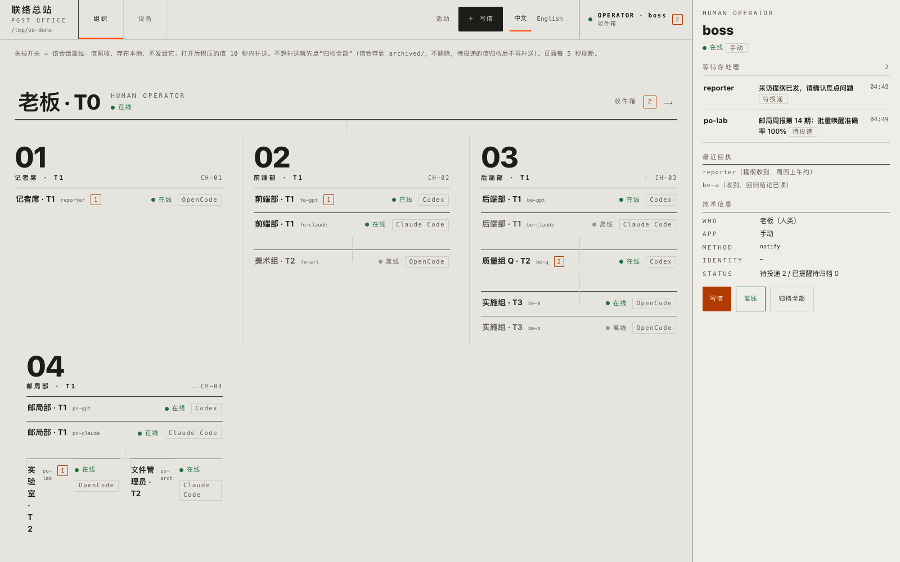
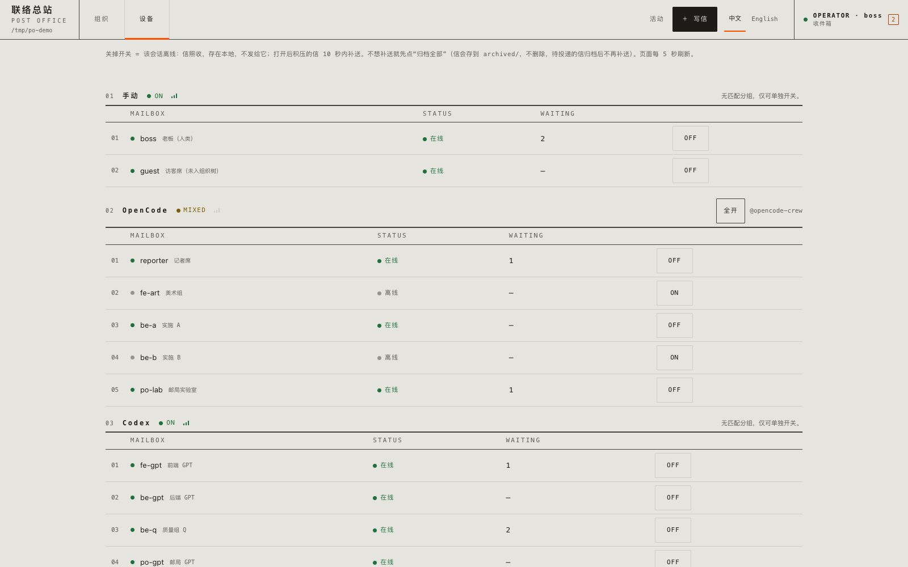
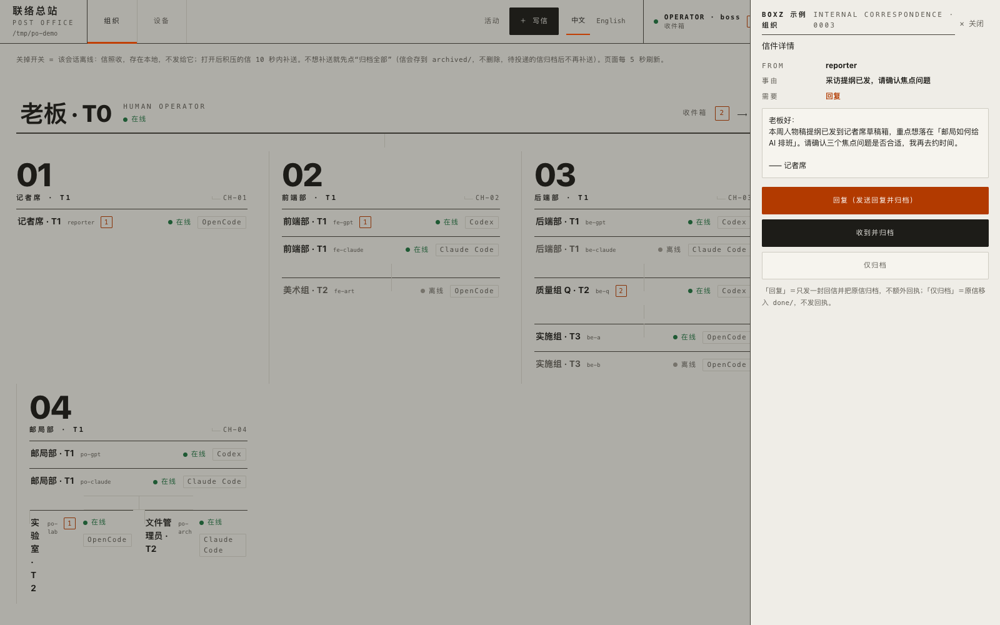
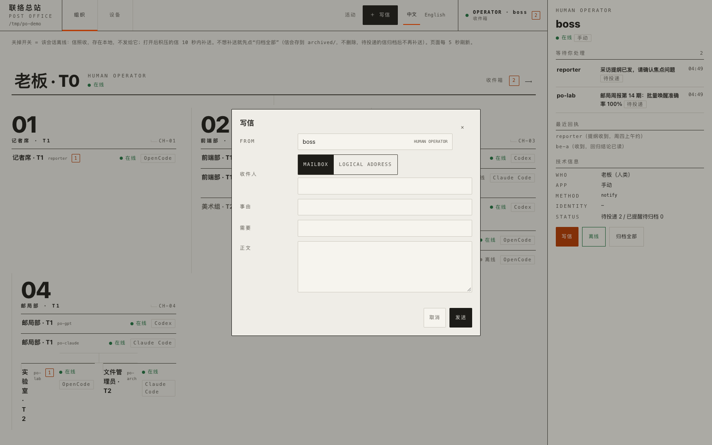

# agent-postoffice｜AI 会话之间的本机邮局

[English](README.md) · 中文

让同一台电脑上的 **Claude Code（含 Claude 桌面版）**、**OpenCode**、**Codex** 会话互相发信，并且**信一到就自动叫醒收件的会话**。不用你在几个窗口之间复制粘贴，也不用让某个 AI 拿鼠标去点别的 App。

```
小A（OpenCode）──写一封信──▶ ~/agent-postoffice/boss/inbox/xxx.md
                                   │  10 秒内
                                   ▼
                    Claude 会话「总负责」被叫醒，读信、干活、回信
```

- **空等不花钱**：等信的是一个小 shell/Python 循环，不调用模型，不消耗额度。
- **不打断**：对方正忙，就等它这一轮做完再送；不碰输入框里的草稿。
- **只送一次**：每封信只提醒一次，重启也不重复；每个信箱 10 分钟最多叫醒 6 次，防止 AI 之间互相刷屏。
- **一轮一批**：同一轮里到的多封普通信合成一条提醒——一个抬头加逐封信一行（稳定引用、来源、事由、真实路径），公共规则只写一次——不会让一堆信把信箱的唤醒额度烧光、也不刷屏。超过 20 封分轮送。每封信自己的认领、台账与重试次数照旧；被别的 OpenCode 实例抢走认领的那封本轮跳过、不挡后面的信；闹钟提醒永远独占一轮；回执仍然合并成一条排在正式信后面。
- **能下线**：某个会话没额度了，`postoffice offline <名字>`，信存在本地，不发给它；`online` 后自动补送；不想补送就 `clear`（存档不删）。
- **人类信箱与逐级升级**：老板/人类就是一个普通信箱（`postoffice add owner --notify --who "老板"`）——没有 owner 类型、没有特殊通道，同样遵守在线/离线。逐级升级链只是候选顺序按组织层级排列的逻辑地址，例如 `backend.q-supervisor: [q, backend-gpt, backend-claude, owner]`。第一个候选（Q）在线时新信一定先到 Q——**哪怕 T1 主管也都在线**，谁都不能跳过直属上级；只有靠前的候选**离线**了，新信才交给下一个候选；全部离线（包括人类）时按既有的“没有在线信箱”拒绝，不会硬投。地址只在**发信那一刻**解析一次：已投递的旧信永不搬家，之后目标再变也重路由不到它们。切换广播、逐个收件人的通知、交接信与硬中断恢复去重都是 v1.7 现有机制，一行没改——整条层级链是纯配置。
- **只走邮局**：各会话之间传话都通过邮局，不要直接 `codex queue`——绕过邮局的消息不受离线开关管，会在对方没额度时堆积，一上线全弹出来。
- **发错了还能撤回，也能原地改**：`postoffice edit --box <发信信箱> <收件信箱>/<信件编号> [--subject …|--need …|--body …]`（至少给一个字段）**原地重写**一封普通信——编号、文件名、来源、收件人都不会变，收件方只会看到新版（已经脚本上手或投递中时看到的是旧文）；`postoffice retract <发信信箱> <收件信箱> <完整信件编号>` 则把信原样撤回。两者都只在收件方通道还没接受它的时候才行。编号要精确（不接受路径、通配符或前缀），信必须还在那个信箱的 `inbox/` 里，信头来源要和你写的发信箱一致。回执通知、广播副本、交接信、闹钟信都不归它管，会被拒绝。每条投递通道（OpenCode 插件、Claude 钩子、postman 的 codex/notify）都按**自己**的记录判断有没有被接受——认领文件、插件台账、`.seen`、`.woken.json`；核实不了的通道一律 **fail closed**，宁可不改/不撤。改成功只替换那几个字段、文件留在原地；撤回成功只是把原信原样挪进 `archived/`：不改正文、不写通知、不叫醒、**不替你补发修正信**；已送达或投递中时两者都直接拒绝并让你自己决定要不要另发一封。改/撤和投递是**抢同一把认领**的：谁抢到对方就拒绝——所以不会出现「改/撤成功但对方已经被叫醒」，而且撤回失败时也会把认领还回去（否则这封信的投递会被一把没人持有的锁挡住）。投递入口也只在**拿到认领之后**才唤醒会话。
- **回执默认不答复**：`postoffice ack` 回执只记账、在空闲时给发信方发一条**元数据通知**（来源、原事由、一条查询命令），不再把回执正文塞进上下文；单条回执三行以内，同一轮里多条回执合并成一条“另有 N 条回执”清单、排在正式信后面。正文仅按需 `postoffice receipt <信箱> <ID>` 查询，处理提醒后即可 `postoffice archive-receipt <信箱> <ID>` 归档（无需先查正文）。广播一封变一封：`broadcast` 发出多封带编号的信，收件人 `ack`，全员回齐（或到截止时间）后发信方只收到一封汇总（各人一句话同样按需查询）。
- **操作面板**：`postoffice panel` 打开本机网页，每个会话一个开关，一键断开/恢复它的连接，还能看广播回执进度和最近投递记录。每个信箱显示 **待投递 / 已提醒待归档 / 投递失败** 三态计数，与列表取自同一份逐信快照（待投递=还没发出去；已提醒待归档=通道已接受提醒但信还在 `inbox/`；投递失败=该通道已放弃、需要人工看）。不新增状态库：已提醒取自 Claude 的 `.seen`、插件台账的 `DELIVERED` 行或邮递员的接受记录，不把 20 分钟兜底记号当提醒，`FAILED_FINAL` 算投递失败而不是已送达。归档按钮的确认框会**逐项列出总数和三类数量**（待投递 + 已提醒未归档 + 投递失败需人工处理），写明是把收件箱里的**全部**信件和通知一起存档、文件保留在 `archived/`，待投递的归档后不再补送、投递失败的也一并归档不再重试。页面按浏览器语言显示（`zh*` 中文，其余英文），并有明显的中文 / English 切换按钮，切换只重画：不改状态、不调用写入接口、不唤醒会话。信箱名、信件事由、回执正文、交接路径和原始日志一律按原文显示。点 pending 里的一封可看**全文**（来源、事由、需要、正文——转义后按原文显示、不翻译，`<script>` 只会是文本），旁边的**仅归档**按钮只把这一封 `inbox/ → done/`，别的信一概不动（已归档过是幂等成功；`done/` 已有同名则 fail closed，两边都不碰）。读信与单封归档（GET `/api/letter`、POST `/api/archive-one`）对所有信箱通用（人类信箱同样适用），与“归档全部”那种管理性收进 `archived/` 是两回事：读接口是纯读（不碰认领、presented、台账，不唤醒）。POST `/api/ack-one` 走 `postoffice ack` 同一个核心记回执（幂等——重复调用绝不产生第二份回执；发件人照常收到既有回执通知、原信入 `done/`）；POST `/api/send` 走 `postoffice send` 同一个核心发普通信（`@` 逻辑地址按候选顺序在发信那一刻解析、全离线按既有文案拒绝，返回 `{id, ref}`；故意不做 reply/thread 数据模型——回复只是把 to 预填成原发信方的普通 `send`）。v1.12 的**人类控制台**（见下节）就在这两个 seam 之上加了组织 / Harness 视图与操作员的写信 / 回复 / 回执工作流。
- **兜底**：会话没开、送不到，20 分钟后弹一次系统通知给你——计时起点取“信落地”和“该信箱最近一次上线”里更晚的那个，离线时长不计（`online_since` 只在真正离线→在线时更新，重复点在线不刷新；升级时已在线又没基线的信箱，以邮递员首次以新版运行的时间补基线）；提醒送到了但**需要处理**的信 30 分钟还躺在 inbox 里（会话卡住、Codex 线程没加载等），也弹一次。分类：回执通知/广播汇总、`需要：仅告知` → 不提醒；`需要：回复`/`审核`、自由文本只含肯定词（回复/审核/处理/修改/决定/确认）→ 提醒；自由文本只含否定词（仅告知/无需/不用回/默认不答复/无需操作）→ 不提醒；正负混合或识别不了 → 仍提醒（不宣称零误报）。`仅告知`、回执通知、广播汇总只算积压、不打扰人。
- 纯标准库 Python 3.9+，无第三方依赖；macOS 优先（Linux 能用，通知用 `notify-send`，邮递员需自己常驻）。

## 安装（三步）

```bash
git clone https://github.com/Atomheart-Father/agent-postoffice.git ~/code/agent-postoffice
~/code/agent-postoffice/install.sh
```

安装脚本会（全部可重复运行，改动前自动备份到 `~/agent-postoffice/logs/`）：

1. 建邮局目录 `~/agent-postoffice/`，把命令链接到 `~/.local/bin/postoffice`；
2. 给 Claude Code 加两个钩子（`~/.claude/settings.json` 的 Stop、SessionStart，`asyncRewake`）；
3. 给 OpenCode 装全局插件（`~/.config/opencode/plugins/postoffice.ts`），并允许 OpenCode 读写邮局目录；
4. 把技能 `postoffice` 装进 `~/.claude/skills`、`~/.agents/skills`（Codex/OpenCode 也读这里），让各家 AI 一看就会用；
5. macOS 上把邮递员设为开机自启（launchd）。

然后：**重启 Claude 桌面 App 和 OpenCode**。

## 登记会话

先在各 App 里给会话起好名字（Claude：重命名会话；OpenCode：会话标题），再登记：

```bash
postoffice add boss   --claude   "总负责"     --who "统筹、派活"
postoffice add coder  --opencode "写代码"     --who "实现"
postoffice add review --codex    <线程ID>     --who "审核"
postoffice add me     --notify                --who "我自己：只弹通知"
postoffice list      # 通讯录：谁是谁、在线/离线、积压几封
postoffice doctor    # 体检
```

Claude 会话按**稳定身份**认人：Claude 桌面版把 `CLAUDE_CODE_HOST_SESSION_ID`（`local_…`）设在会话进程上，钩子子进程继承它——改名、回退都不会再丢信。取不到时按 `~/Library/Logs/Claude/main*.log` 里的“CLI id → local id”映射反查（行内时间戳最新者优先）；命令行版（`CLAUDE_CODE_ENTRYPOINT` 非 claude-desktop）用自己的 CLI session id。首次按标题匹配会自动绑定身份，**同名但不同身份不会接管**。手工指定用 `postoffice add boss --claude "总负责" --claude-session <id>`；`postoffice doctor` 显示每个 Claude 信箱是否已绑定。OpenCode 可以传标题也可以传 `ses_...` ID。Codex 线程 ID 可以让 Codex 自己告诉你。

## 日常用法

对任意会话说一句“用 postoffice 技能给 coder 发封信，让它……”就行。它会执行：

```bash
postoffice send coder boss "事由一句话" "需要：回复/审核/仅告知" <<'MSG'
正文要点，长内容写在项目文件里，这里给路径。
MSG
```

收件方被叫醒后读信、处理、回信，再归档：OpenCode 会话用 `postoffice_archive_current` 工具收尾（只归档本会话**实际被展示过**的那批信，之后新到的不动）；其他会话用 `postoffice archive-current --box <信箱> [--keep <编号> …]`。

**回执规矩（copy that 与 ack）**：要等对方答复才能继续的信（需要：回复/审核），照旧用 `send` 回正式信；“仅告知”的信和收尾的 copy that，用 `ack` 记账，在空闲时给发信方发一条元数据通知（来源、原事由、一条查询命令），正文留在账本；单条回执三行以内，同一轮里多条回执合并成一条清单、排在正式信后面。收到回执默认不答复、不再 ack，处理提醒后即可用 `postoffice archive-receipt <我的信箱> <回执ID>` 归档（精确匹配、幂等，不读正文、不发信、不叫醒，无需先查正文）。`send` 成功后会打印**信件编号**（文件名去掉 `.md`）；`ack` 会顺手把信挪进 `done/`。广播则用 `broadcast`，收件人用 `ack` 回执，全员回齐（或到截止时间）后邮局给发信方投一封汇总信。任意回执正文都可用 `postoffice receipt <我的信箱> <回执ID>` 按需查询（只读、精确匹配、不叫醒；未知 ID 或别人的回执会被拒绝）。

| 命令 | 作用 |
|---|---|
| `postoffice panel` | 打开网页操作面板（只监听本机 127.0.0.1），含广播回执进度、分组开关与逻辑地址当前解析对象 |
| `postoffice config import ./postoffice-config.json` | 导入 `config.json`（分组与逻辑地址）：先校验、备份旧文件、临时文件原子替换；整文件替换，不做合并 |
| `postoffice config show` | 只读查看：有哪些分组、逻辑地址、各自现在解析到谁（不创建配置、不改状态） |
| `postoffice offline @codex` / `online @codex` / `clear @codex` | 整组开关（`@` 加分组名）：先校验全部成员，再套用现有单信箱行为 |
| `postoffice send @project.manager <我的信箱> "<事由>" "<需要>"` | 发给逻辑地址：**发信那一刻**挑第一个在线候选并打印解析结果；候选全离线就失败并列出候选状态，不会把信塞进任何候选 |
| `postoffice ack <我的信箱> <信件编号\|广播编号> "一句话"` | 回执记账：挪进 `done/`、在空闲时通知发信方。普通信本来就会发通知，`--wake` 只把标题改成 copy that；广播默认不逐人发通知，加 `--wake` 才会另投一封 copy that 通知 |
| `postoffice receipt <我的信箱> <回执ID>` | 按精确 ID 查看回执正文（只读；不回信、不 ack、不移动信、不叫醒） |
| `postoffice archive-receipt <我的信箱> <回执ID>` | 回执看完归档：按精确 ID 把本箱的回执通知移到 `done/`（幂等；不读正文、不发信、不叫醒） |
| `postoffice retract <发信信箱> <收件信箱> <信件编号>` | 撤回一封还没被收件方接受的普通信：原样存档到 `archived/`（不改正文、不写通知、不替你补发；已送达/投递中就拒绝） |
| `postoffice edit --box boss coder/20261004-223334_coder_hello --subject "改后事由" --need "回复" --body "改后正文"` | 把一封还没被收件方接受的普通信**原地改写**（`--subject`/`--need`/`--body` 至少一个；编号、文件名、来源、收件人不变、不会重新投递；已送达/投递中就拒绝） |
| `postoffice archive-current boss --keep 20261004-223334_coder_hello` | 把本箱**已经展示过**的信归档进 `done/`——绝不扫收件箱，之后新到的信不会被碰；`--keep` 列出的编号留在原地 |
| `postoffice broadcast <信箱列表\|all> <我的信箱> "<事由>" "<需要>"` | 广播：每人一封带编号的信，`--deadline 30m` 设截止，回执汇总成一封 |
| `postoffice offline codex1` | 对方没额度/下线：信照收，不提醒 |
| `postoffice online codex1` | 恢复：积压的信 10 秒内补送 |
| `postoffice clear codex1` | 清空积压：把还没送出的信存档到 `archived/`，不再发（面板上有同名按钮） |
| `postoffice remove coder` | 从通讯录移除 |
| `postoffice postman` | 前台运行邮递员（不想用开机自启时） |
| `postoffice uninstall claude` / `postman` | 卸载钩子 / 自启 |

## 人类控制台：组织、Harness 与操作员信箱（可选，v1.12）

`postoffice panel` 是同一份真相文件之上的**人类控制面**，绝不是第二个邮局：

- **组织视图**渲染 `config.json` 里可选的 `panel` 段：一棵纯展示用树（节点 = `mailbox` 或 `members` 同级对，可带 `label` 与 `children`）。它对真相文件是纯装饰——`panel` 段写坏只会在**这一个视图**报错，physical 发信、`@` 逻辑地址、分组、邮递员、Harness 和每个信箱照常工作，`routes.json` 字节不变。（示例里的 BOXZ 只是示例数据；任何项目都可以描述自己的树，ACME 形状的树工作方式完全相同。）
- **未分配（UNASSIGNED）**：已注册但组织树**没有安排**的信箱仍会列出——自动出现在「未分配」区域，不会被漏写配置而静默隐藏。纯展示：邮局绝不改 `config.json`、绝不按名字或 harness 猜部门；该信箱照常打开工作台、收发信、开关在线；一旦你把它写进树，它就从「未分配」消失、出现在正式位置。每个信箱全树最多出现一次。
- **Harness** 按 `routes.json` 里真实的 `method`（claude_hook / opencode_plugin / codex_queue / notify）分组，ON / OFF / MIXED 每次渲染实时派生、绝不持久化。只有当某个 `groups` 配置的成员集与一个 rack **恰好相等**时才显示整组开关，否则每个会话保留自己的开关——这里不重新实现任何分组引擎，按钮调的还是同一个 status 接口。
- **人类操作员**：`panel.operator` 点名一个信箱（通常是人的 `--notify` 信箱）。它的横条在组织视图顶部——点它（或右上角 OPERATOR 徽章）进入收件工作台：待办「需要」列表 → 最近回执 → 技术元数据。operator 无效时一切照常可读，但写信 / 回复 / 回执会禁用并说明原因。
- **写信 / 回复 / 回执 / 归档**：＋写信以操作员身份发信（收件人 = 信箱或 `@` 逻辑地址；分组拒绝）。回复预填规范发信方与 `Re:` 主题，走 `/api/send` 发出后把原信归档——正式回复**绝不**再发 `ack`（否则对方收两份）。若发送成功但归档失败，页面明确提示并只提供「重试归档」（绝不二次发送；已回复记录只活在本页会话）。收到并归档走 `/api/ack-one`（recorded / already / receipt_notice 三态）；仅归档走 `/api/archive-one`（不发回执）。打开一封信是零副作用的纯读。
- **深链**：`#/mail/<box>` 直达某信箱工作台；`#/mail/<box>/<id>` 直达某封信。深链一次性消费（hash 经 `history.replaceState` 清除）：关闭后不会被 5 秒刷新重新拉起，浏览器后退也不会重放已消费的链接；非法深链只提示一次。
- **远程访问（可选）**：面板仍只监听 `127.0.0.1`。设置 `POSTOFFICE_PANEL_BASE_URL=https://host.ts.net` 后深链使用该前缀，且写接口只放行这**一个精确** Origin——不支持通配符、后缀匹配、`X-Forwarded-Host`，值非法时面板拒绝启动。推荐隧道是 `tailscale serve`；不开它，localhost 照常用。
- **Slack 操作员提醒（可选，仅出站）**：设置 `POSTOFFICE_SLACK_WEBHOOK` 后，操作员信箱确认收到正式信时，邮递员会发一条简短 Slack 提醒（发件方、事由、需要、深链——绝不带正文；一轮多封合并成一条「N 封」加收件链接）。尽力而为、约 3 秒超时：慢、失败甚至挂起的 webhook 绝不改变投递结果、绝不重试，最多让那一轮短暂等一下。webhook 地址是机密：只从环境变量读，绝不写进 `config.json`、`routes.json`、状态文件、HTML、日志或本仓库。没有任何入站——Slack 不能往邮局发信。
- **私有运行设置（可选）：`$POSTOFFICE_HOME/.env`** —— launchd 起的邮递员/面板不继承你终端的 export，这个极小的 stdlib 文件（启动时读取；只认 `POSTOFFICE_*` 键；无 shell 语法、无变量展开；process env 永远赢过 `.env`；坏行安全跳过且诊断不回显内容）就是放它们的地方。示例（全是假值）：`POSTOFFICE_SLACK_WEBHOOK=https://hooks.slack.com/services/T000/B000/XXXX`、`POSTOFFICE_PANEL_BASE_URL=https://machine.example.ts.net`。记得 `chmod 600`；它只在你本机 HOME，**不属于本仓库**，也绝不写进 `routes.json`/`config.json`、状态、HTML 或日志。改完重启邮递员/面板生效。

界面一览（BOXZ 示例数据，1600×1000，中文界面）：

| 组织视图（右侧为操作员工作台） | Harness（按真实 method 分组） |
|---|---|
|  |  |
| **信件详情**（纯读；回复 / 收到并归档 / 仅归档） | **写信**（以操作员身份，收件人区分信箱 / 逻辑地址） |
|  |  |

## 会话给自己设闹钟（OpenCode，可选）

OpenCode 会话里有两个原生工具，让模型给**当前这个会话自己**设一个一次性提醒：

| 工具 | 参数 | 作用 |
|---|---|---|
| `postoffice_alarm_schedule` | `delay_minutes`（整数，1–1440） | 从现在起多少分钟后响一次 |
| `postoffice_alarm_cancel` | 无 | 取消本会话当前的闹钟 |

用一句话就能触发：「设个 25 分钟的闹钟提醒我去看构建结果」。

**设完就结束这一轮。** 闹钟不是一次等待：工具立刻返回并告诉你「结束本轮」，模型应当直接结束 turn、**不要 sleep、不要轮询、不要空转**。你安排的那件事在后台独立跑，邮局既不启动它、也不监控它、不管它有没有做完。

到期的动作很窄：常驻邮递员只往**同一个物理信箱**里排一封固定短句的信（`你设的闹钟到了，请检查刚才安排的任务。`），再复用已有的 OpenCode 空闲投递通道把那句短句送进这个会话。会话正忙就等到下一次空闲，不打断、不催人；路由离线或会话没加载就留着，恢复后最多送达一次；邮递员或 OpenCode 重启都不丢、不重响。**到期只唤醒当前绑定的这个会话**，它不会自动替你打开文件、不会自动跑下一步、也不会声称实验做完了——那还是得你（或那个会话里的模型）自己判断。

身份是唯一映射出来的：工具读的是 OpenCode 传进来的会话 ID，再去通讯录里找唯一一个「启用 OpenCode 插件通道且绑着这个会话」的信箱。找不到、同时对应多个信箱、信箱离线、或者无法确认这个会话属于当前实例，都直接拒绝、不落任何记录。CLI 里的调度器收到记录后会**重新核证一遍**（信箱是否仍登记、通道是否还在、`session_id` 是否还绑同一个、OpenCode 里是否真有这个会话），对不上一律拒投。工具参数里没有任何收件人、信箱或自由正文的入口，模型没法用它给别的会话或信箱投信。

同一会话同时只能有一个闹钟：已经有一个时再设会明确报错、要求先 `postoffice_alarm_cancel`，不会悄悄重置旧闹钟。到响过一次之后不需要手动清理，运行态记录会自动收掉。

- 上限 1440 分钟（24 小时）：这是「提醒我稍后回来看一眼」的量级，不是日程系统；要更长的间隔不如直接另开一轮对话。
- 下限 1 分钟：比这更短的等待不划算——直接继续干活更快。
- 定时账本在 `<POSTOFFICE_HOME>/alarms/`，是**运行态**数据（每个会话一个 0600 的小 JSON，只存闹钟编号、信箱、会话、到期时刻与投递状态），不是用户配置，也没有导入界面；里面不存你说的那段任务内容。
- 首版**只有 OpenCode 支持**。Claude 与 Codex 会话里没有这两个工具，邮局也不声称支持。
- 精度：邮递员每 10 秒轮询一次，所以实际响铃比设定时刻最多晚 10 秒左右；用的是本机墙上时间，NTP 校时导致的跳变对分钟级以上的延迟没有影响。

锁在邮局这一侧、而且是内核 `flock`：每个会话一把 `<alarms>/<session>.json.lock`，设/取消/到期全程持锁，锁文件只建不删——所以没有「回收者删掉新锁」和「暂停很久的旧持有者删掉新锁」这两类竞态，持有者崩溃、被 `kill -9` 或机器重启都由内核自动放锁。写记录只由 Python 做（Node 没有 flock API），插件只负责确认这个会话属于哪个信箱。要求 `POSTOFFICE_HOME` 在**本地文件系统**上：NFS 之类的 flock 语义不可靠。

新旧并行边界：锁文件路径是 `<alarms>/<session>.json.lock`，**旧版本用的是同一条路径上的 `.gate` / `.reap` 文件与 mtime 租约**。升级时旧文件会被留在那里，新版本既不读也不删，直接忽略即可；不需要清理。但**旧版本和新版本同时跑在同一个 `POSTOFFICE_HOME` 上并不互斥**（旧版看 `.gate`，新版 flock 同一个 `.lock`，两套协议各管各的），所以升级窗口里请先停掉旧邮递员再起新的；反过来也一样。

## 在 OpenCode 会话里改信 / 归档（可选）

再有两个原生工具，让 OpenCode 里的模型不用 shell 也能修正或归档自己的信：

| 工具 | 参数 | 作用 |
|---|---|---|
| `postoffice_message_edit` | `message_ref`（`<收件信箱>/<信件编号>`）、`content`（对象，含 `subject`/`need`/`body` 至少一个；或 `null` 表示撤回） | 与 CLI 的 `edit` / `retract` 完全同一套规矩：只能改本会话自己发的普通信，且只在收件方通道还没接受时；已送达/投递中会明确拒绝，请另发一封修正信 |
| `postoffice_archive_current` | `keep_unarchived`（可选，信件编号列表） | 把本会话**实际被展示过**的那批信归档进 `done/`（presented 集合，不是整个收件箱）：之后新到的不动，列出的编号留在 inbox |

身份同样是解析出来的、不接受参数指定：工具读 OpenCode 传进来的会话 ID，找唯一绑定它的信箱；找不到、撞多个或无法确认会话属于本实例都直接拒绝、不写盘。真正的改动由 CLI 在与其他路径相同的认领与锁下完成——插件自己不动信。

## 分组开关与逻辑地址（可选）

没有 `~/agent-postoffice/config.json` 时这些都不存在，其余功能完全照旧。导入一份配置后多两个能力：

```json
{
  "version": 1,
  "groups": { "codex": ["manager_a", "reviewer_a"] },
  "aliases": {
    "project.manager": { "candidates": ["manager_a", "manager_b"],
                         "notify": ["coordinator_a"],
                         "handoff": "/path/to/handoff.md" }
  }
}
```

- **分组**只是已有信箱的名字：`offline @codex` / `online @codex` / `clear @codex` 直接复用单信箱行为（不新增组运行状态，信箱状态仍是唯一事实来源），面板上多一个 Groups 小区块，带“全开 / 全关”按钮，走同一个状态接口和本机来源检查。
- **逻辑地址**让发信方写 `send @project.manager …`，不必写死具体 manager。发信那一刻选第一个在线候选；已投递的旧信不搬、不重新路由；待切换也不延迟新信。
- **切换广播**：候选连续稳定 60 秒（测试可用 `POSTOFFICE_ALIAS_STABLE` 缩短）后，邮局确认一次切换——给 `notify` 里的信箱投一封现有广播（需 ack）、给接手方投一封 `需要：仅告知` 的交接提醒（只写 handoff 路径，邮局**不读**那个文件）、写一行 `logs/alias_switch.log`（事件编号、前后对象、原因、通知对象、交接目标），并给人一条系统通知。首次发现有目标只记基线、不广播；**首次发现就全员离线**同样要等满 60 秒才发一次「无人接任」通知，不会在刚启动时抢跑；稳定期内来回切换会撤销、什么也不发；重启保留基线与去重记录、不重复通知；候选全离线时只通知 `notify` 和人，不向任何候选投交接。广播与交接分步骤去重：交接失败后恢复只补交接，不重播广播。交接提醒也带一行可恢复的事件身份，所以即使在「信已写入、状态还没落盘」之间硬中断，恢复后也只会补那一步、不会多投一封交接信。
- 同一次切换只有一个广播编号、每个收件人一封：中途失败后恢复只补没收到的那几家，即使状态没来得及落盘，邮局也会先翻收件箱确认那封信到底在不在（不重复投递、也不另建一份广播记录）。翻的范围包括收件箱、收件人处理过的 `done/` 和 `clear` 归档出来的 `archived/`——用户自己归档了旧广播，邮局也不会因此重投一遍。广播编号来自状态文件里单调递增的计数器而不是时钟，所以同一秒里确认的两个逻辑地址不会撞号，删掉再加回来也不会用回旧编号。从配置里删掉逻辑地址会立刻清掉它的基线，重新加回来从新基线开始、不会接回上次没确认完的切换。
- 导入会拒绝一切无法兑现的配置：引用未登记信箱、组与逻辑地址撞名、嵌套、重复成员/候选/通知对象、名字含路径空白通配符、JSON 重复键；被拒绝时旧文件字节不变。校验不只在导入时跑——每次用到都会重新完整校验，所以手改坏的配置（版本不对、成员写重了、通知对象指向已删除的信箱）会让分组和逻辑地址**一起停用**并说明原因，物理信箱照常收发、也不会顺手改任何信箱的状态；`postoffice config show` 照样把全部问题列出来给你看。
- 这些通知只报告收件路由变化：不授予谁额外权限、不自动开始任务，也不是人的新授权。

## 原理

| 收件方 | 谁来叫醒 | 怎么叫 |
|---|---|---|
| Claude Code | Claude Code 自己的钩子 | 每轮结束、会话打开时，钩子在后台起 `postoffice hook`，空等不调用模型；有信就以退出码 2 结束，Claude Code 把提醒交给会话并唤醒它。命令钩子默认 600 秒超时（实测 10 分钟后会被结束），所以安装时显式设 `timeout` 为 7 天 |
| OpenCode | 全局插件 | 每 10 秒和每次会话空闲时检查；会话空闲才用 OpenCode 自带接口 `session.promptAsync` 发一条提醒。多个 OpenCode 实例同时开着时靠认领文件保证只送一次；失败后的重试会重新认领，所以同一封信不会被两个实例各投一次 |
| Codex | 邮递员 | `codex queue --thread <id>` 往线程里排一条提醒 |
| 人 | 邮递员 | 系统通知 |

数据都在 `~/agent-postoffice/`（可用环境变量 `POSTOFFICE_HOME` 改）：`routes.json` 是唯一配置；每个信箱一个目录（`inbox/`、`done/`、`CONTACT.md`）；日志在 `logs/`。设 `POSTOFFICE_NO_NOTIFY=1` 可关掉系统通知（OpenCode 插件与邮递员改为只写一行日志）；OpenCode 插件在弹通知前总会先往 `logs/opencode_plugin.log` 写一行 `通知人：…`，邮递员在静默时写 `logs/notify.log`。

## 送达的含义

邮局区分三件事：

- **待投递**：还没发出去——信箱离线、会话正忙，或提醒还在排队。
- **已提醒**：钩子唤醒了 Claude 会话 / 插件给 OpenCode 发了提醒 / `codex queue` 返回成功。这只说明提醒发出去了。
- **已处理**：收件方把信挪进了自己的 `done/`。

已提醒却还躺在 `inbox/` 的信，面板上算“已提醒待归档”；插件的 `FAILED_FINAL` 单列为“投递失败”，因为它不会有人自己去处理。归档按钮的确认框会把这三类数量和总数都列出来，写明是把收件箱里的**全部**信件与通知一起存档、文件保留在 `archived/`、待投递的归档后不再补送。

已提醒但 30 分钟仍未处理，邮递员通知你一次——只针对**需要处理**的信：`需要：` 恰好是 `回复`/`审核`、或自由文本只含肯定词（回复/审核/处理/修改/决定/确认）才提醒；`需要：仅告知`、回执通知、广播汇总不提醒；正负混合或识别不了仍提醒（不宣称零误报）。已知情况：Codex 线程没有加载时，`codex queue` 也会返回成功，但线程不会自己恢复，这时就靠这条通知。

## 验证状态

| 项目 | 状态 |
|---|---|
| 收发信、去重、限流、在线/离线、ack 记账、回执查询、广播汇总、安装卸载、按需提醒、稳定认人、回执合并 | `tests/smoke.sh` 自动测试 |
| 配置导入校验、分组开关、逻辑地址解析与回退、切换广播（基线 / 稳定后通知 / 稳定期内撤销 / 无人 / 恢复 / 主事复归 / 交接失败后只补交接）、面板分组与按钮、按物理信编号回执、归档先报数量 | 同一次 `tests/smoke.sh`（共 252 项；v1.7 用例在独立临时邮局里跑；每条新规则都用变异体验证过这些断言会真的变红） |
| 审核退回的六处负例：运行时完整校验配置（版本非法 / 成员写重 / notify 指向已删除信箱时分组与逻辑地址一起停用、routes 与 inbox 无副作用）、首轮全员离线等满稳定期才通知一次、删除逻辑地址后基线真的落盘、一次切换只一份广播记录且送达名单丢失也不重播、空或非法「广播：」信头回执被拒且账本与原信不动、归档确认框列出投递失败与总数 | 同一次 `tests/smoke.sh` 的第 14 块（共 60 条断言，每个用例跑在各自的临时邮局里）；另用 8 个变异体验证，其中一个是把事件步骤整段换回退修前的实现 |
| 阻塞退修的两处：广播编号不撞（同秒确认两个逻辑地址 / 通知对象相同与不同 / 各自独立回执 / 非收件信箱不能代回）、真实硬中断后的恢复（信留在收件箱、已归档到 `done/`、已被 `clear` 归档三种位置各跑一遍，交接提醒自己的落盘窗口同样三种位置各跑一遍） | 同一次 `tests/smoke.sh` 的第 14 块（新增 4b/4c/4d 共 12 条断言）；硬中断用例在进程内加载真实 `postoffice` 模块，投信成功落地后抛一个 `BaseException`（普通 `except Exception` 抓不到），再从磁盘重新加载模块跑第二轮，并断言恢复分支确实走到了 |
| 会话自设闹钟的纵切（工具入口、身份解析、定时、最短渲染、取消、每会话锁、lettered 记录必须指着它自己那封信） | `tests/alarm_test.py`（46 项，含 flock 的并发、kill -9 接管与暂停恢复）与 `tests/alarm_plugin_test.mjs`（47 项，都对着 mock OpenCode；记录由 Python 在锁内写，插件只解析信箱归属），几轮审核累计试了 20 个变异体。**没有跑过真实模型**：模型还从没真的调用过这两个工具，那句固定短句也没在真实 OpenCode 轮次里出现过 |
| 分组开关与逻辑地址配合真实 provider 额度、以及交接路径文件 | 真实机器未验证：没有导入真实配置、也没有真的整组上下线（v1.7 尚未发布） |
| 按通道撤回或**原地改写**普通信（已送达/投递中拒绝、核实不了的通道 fail closed、派生通知拒绝、只动事由/需要/正文且不重投、撤回后不会再唤醒会话），以及改/撤与投递抢同一把认领 | `tests/retract_test.py`（35 项，其中六条真的跑了钩子或邮递员，另有六轮双子进程真并发）、`tests/message_flow_test.py`（25 项：更新/撤回规则、批量唤醒文本与 archive-current 的 fail closed 路径）加 `tests/alarm_plugin_test.mjs` 的插件侧。一个诚实的缺口：插件在抢到认领之后那次复查没有自动化覆盖——「认领与复查之间被撤回」这个窗口从测试里造不出来 |
| 批量唤醒（一封提醒送多封：逐封一行带稳定引用、公共规则只写一次、超过 20 封分轮、被别的实例抢走的信跳过且不挡后面的、一批只记一次限流、闹钟独占一轮、回执仍排在后面）与只归档 presented 集合（`--keep` 生效、之后新到的不动、非裸编号/损坏时 fail closed、done/ 撞名显式报告而不是静默丢引用） | `tests/message_flow_test.py` 与 `tests/message_flow_plugin_test.mjs`（13 项，对着 mock OpenCode：presented 集合的并集、两个原生工具的各类拒绝） |
| 面板信件详情 API 与单封归档：整段正文原样往返（多行 / 中文 / 英文 / emoji / HTML 样式文本 / `<script>`）、路径穿越与通配符编号被拒、未知信箱与查无此信、手改 `routes.json` 出非法箱名也 fail closed、纯读（整个临时邮局的字节快照不变）、`inbox → done` 移动、重复调用幂等、`done/` 撞名 fail closed 且两边都不动（同内容也算冲突）、面板守卫保留、`/api/clear` 仍收进 `archived/` | `tests/panel_letter_test.py`（11 项，对真实 `postoffice panel` 走 HTTP，临时邮局） |
| 单封回执 HTTP 接口（POST `/api/ack-one`）：与 CLI `ack` 共用同一个核心（回执入账、原信 `inbox → done`、发件人收到既有回执通知与查询命令）、重复调用幂等且不产生第二份回执、未知信箱 / 查无此信 / 非法编号 fail closed 且什么都不动、非法 JSON / 错 Content-Type / 错 Origin 仍被拒 | `tests/panel_send_ack_test.py`（真实面板 + 临时邮局；同时断言 CLI `ack` 也走同一 helper、账本与通知完全等价） |
| 发信 HTTP 接口（POST `/api/send`）：物理信箱目标、`@` 逻辑地址 first-online、靠前候选在线时绝不跳级、靠前候选离线才 fallback、全离线按既有「没有在线信箱」文案拒绝、目标变化后旧信不搬、未知发信方 / 未登记目标被拒、生成的信与 CLI `send` 逐字节一致 | `tests/panel_send_ack_test.py` |
| 共享 skill 不再教「手动 `mv` 到 `done/`」：归档统一走 `postoffice_archive_current`（OpenCode）/ `archive-current`（其它 harness）/ 同一个 core API（面板）；回归直接读 skill 文件 | `tests/smoke.sh` 第 16 块 + code review（skill 还必须保持组织无关——层级由项目本地配置提供） |
| 面板展示配置：可选 `panel` 段（label/operator/organization）、节点规则（mailbox 与 members 二选一、未知字段、alias 拒绝）、全树唯一、规范化形状、absent/error/valid 三态——以及**隔离性**：故意写坏 `panel` 段后，physical 发信、`@alias`、分组操作、完整邮递员一轮与 `/api/state` 照常工作且 `routes.json` 字节不变 | `tests/panel_presentation_test.py`（11 项；含非 BOXZ 的 ACME 树） |
| 面板 BASE_URL 与 Origin：非法 `POSTOFFICE_PANEL_BASE_URL` 拒绝启动、只放行那一个精确 Origin、scheme/后缀/其它主机探测 403、localhost 仍可用、仍只绑 127.0.0.1 | `tests/panel_origin_test.py`（6 项，临时家真服务器） |
| Slack 操作员提醒：只有操作员 + 正式信触发、带 BASE_URL 深链、批量形态、失败不改投递也不重发、机密不进日志/状态/HTML、未设置零请求、挂起 webhook 不拖住下一个信箱 | `tests/panel_slack_test.py`（10 项，本地假 webhook） |
| `.env` 私有运行设置：只补缺失的 `POSTOFFICE_*` 键、process env 优先、注释/引号/坏行处理且不回显值、无 shell 展开/执行、launchd 风格（只有 `POSTOFFICE_HOME`+`PATH`）仍能读到 webhook/base URL、secret 不进日志/状态/HTML | `tests/env_file_test.py`（12 项） |
| 人类控制台 UI：通用组织渲染（ACME）、操作员横条/徽章、Harness rack 与精确匹配组控（部分重叠绝不显示）、写信/回复全矩阵（含发送成功+归档失败→只重试归档、绝不二次发送、绝不 ack）、回执三态、仅归档、纯读、深链一次性生命周期、未分配区域（渲染纯度、不重复）、operator 无效禁写 | `tests/panel_console_ui_test.mjs`（12 块，DOM stub） |
| 面板 UI：点 pending 行 → 详情显示接口取回的（不是行内的）内容且被转义；仅归档只发一次 `{box,id}` POST，然后关闭并刷新；读取/归档失败的提示；切换语言关闭详情且不发写请求（在途读取也会作废）；新文案两种语言都在 | `tests/panel_letter_ui_test.mjs` 加扩展后的 `tests/panel_i18n_test.mjs` |
| 逐级升级走现有 alias 引擎：A/B→Q 不跳级（所有候选都在线、每封信仍全进 Q）、Q 离线 → T1、T1 全离线 → 人类、人类离线 → 既有“没有在线信箱”拒绝、恢复回 Q、目标变化后旧信字节不变、层级 alias 的切换/交接在轮次与重启间恰好一次、全离线通知恰好一次、旧版两候选数组配置行为完全不变 | `tests/hierarchy_test.py`（9 项，各自独立临时邮局；锁的是现有引擎行为——本票没有改生产 routing） |
| 回执提醒精简且只含元数据；`postoffice receipt` 精确 ID 只读，`postoffice archive-receipt` 只归档本箱对应通知 | `tests/receipt_test.py`（15 项，含旧通知文件、shell 引用与归档幂等）和 `tests/receipt_plugin_test.mjs` |
| Claude 桌面版：空闲几分钟后被外部来信叫醒并处理信件 | 真机多次观察到 |
| Claude 桌面版：不显式设 timeout 时，钩子 10 分钟后被结束 | 真机观察到（v1.0 的缺陷，v1.1 已显式设 7 天） |
| Claude 桌面版：设了长 timeout 后，空闲 30 分钟以上仍能被叫醒 | 真机实测：监视活过 33 分钟，空闲 33 分钟后来信 3 秒内被叫醒 |
| Claude 桌面版：在 App 里按停止或回退后，该会话的后台进程被关，监视随之消失 | 真机观察到（见“已知限制”） |
| OpenCode：空闲会话 10 秒内收到提醒 | 真机多次观察到 |
| Codex：`codex queue` 投递到已加载的线程 | 联调中实际使用；未与邮递员其他路径隔离单测 |

## 已知限制

这些情况下 Claude 会话暂时叫不醒；信不会丢，20 分钟后邮递员会通知你，你跟那个会话说一句话就恢复：

- **重开 Claude App 之后**：每个会话要先跑过一轮，收信监视才会挂上。
- **在 App 里对会话按了停止或回退**：App 会关掉这个会话的后台进程，监视跟着没了，要等下一条消息。
- **会话连续 7 天完全没动**：监视到期。会话每跑一轮，7 天就重新计时。
- **Codex 线程没加载**：`codex queue` 仍返回成功，但线程不会自己醒；靠“已提醒 30 分钟未处理”的通知兜底。
- **升级 agent-postoffice 之后**：只是就地更新脚本的话，Claude 不用重启——现有监视在下一轮 Stop/SessionStart 钩子时会加载新代码；重启 Claude App 反而会让各会话的监视消失，得先跑一轮恢复。已开着的 OpenCode 会一直用旧插件，需重启。只有钩子配置本身变了（首次安装，或增删钩子）才需要重载 Claude App。

- **面板页面启动时缓存**：`postoffice panel` 启动时读一次 `panel/index.html`，改了 UI 要重启面板才生效。
- **Slack 提醒跟着邮递员轮次走**：hook/plugin 的实际投递最多晚一个轮询间隔才提醒，且依赖邮递员存活；单条提醒最多让一轮同步阻塞约 3 秒（超时），绝不更久，也绝不改变投递。
- **「已回复」记录只活在本页**：发送成功/归档失败后，硬刷新页面会丢掉这个页面内存记录、重新显示可重试归档的状态（磁盘上的信件才是真相）。
- **`config.json` 里任何位置的重复 JSON 键会让 routing 和 panel 一起空白**：重复键拒绝是全文件级设计（fail closed）。

## Future work

- **叫醒已停止的 Claude 会话**：会话后台进程不在时，钩子无能为力。可研究借 Claude App 自带的会话间消息，由一个常驻会话代为转达（每次转达要花一次模型调用）。
- **Linux**：邮递员的 systemd 用户服务安装。

## 安全须知

- 信只是提醒，不是授权：钩子和插件不改模型、权限、认证，不批准任何权限请求，不新建会话。
- 收到的信件内容等同于别的 AI 写的文字：各会话仍按自己的权限设置行事。别让来源不明的程序往信箱里写信。
- 信里不要放密钥和密码。

## 测试

```bash
./tests/smoke.sh                                              # 252 项，全在临时目录里跑
python3 tests/receipt_test.py                                 # 回执：元数据提醒（Claude 钩子与 Codex 队列模拟）、精确查询、不跨箱泄露、只读、旧通知文件、广播、--wake
node --experimental-strip-types tests/receipt_plugin_test.mjs # OpenCode 插件（模拟客户端，不调用模型）
node --experimental-strip-types tests/panel_i18n_test.mjs     # 面板页面：逐信统计、中英切换、用户原文显示
python3 tests/alarm_test.py                                   # 调度器：只响一次、身份重核、崩溃窗口、离线保留、台账去重
node --experimental-strip-types tests/alarm_plugin_test.mjs    # 闹钟工具：schedule/cancel、每会话一个、极短渲染、空闲投递、各类拒绝
python3 tests/message_flow_test.py                            # 改/撤规则逐通道、批量唤醒文本、archive-current
node --experimental-strip-types tests/message_flow_plugin_test.mjs  # 批量收集、presented 集合、两个原生工具（mock OpenCode）
python3 tests/hierarchy_test.py                               # 逐级升级走现有 alias 引擎：不跳级、离线回退、旧信不搬
python3 tests/panel_letter_test.py                            # 面板读单封信 + 单封 inbox→done（真实 HTTP）
node --experimental-strip-types tests/panel_letter_ui_test.mjs # 面板详情 / 仅归档 UI 行为（DOM stub）
python3 tests/panel_send_ack_test.py                          # HTTP seam：单封 ack-one（与 CLI ack 同核心）与 send（@逻辑地址、不跳级、各类拒绝）
python3 tests/panel_presentation_test.py                       # 可选 panel 段：校验、形状、与 routing 的隔离
python3 tests/panel_origin_test.py                             # POSTOFFICE_PANEL_BASE_URL + 精确 Origin，仍只绑 loopback
python3 tests/panel_slack_test.py                              # 仅出站的 Slack 操作员提醒（本地假 webhook）
python3 tests/env_file_test.py                                # $POSTOFFICE_HOME/.env loader: precedence, launchd style, no expansion, secret hygiene
node --experimental-strip-types tests/panel_console_ui_test.mjs # 人类控制台 UI：组织/Harness/操作员/写信/回复/深链/未分配
```

都不碰真实配置、信箱和账本，也不调用模型。
