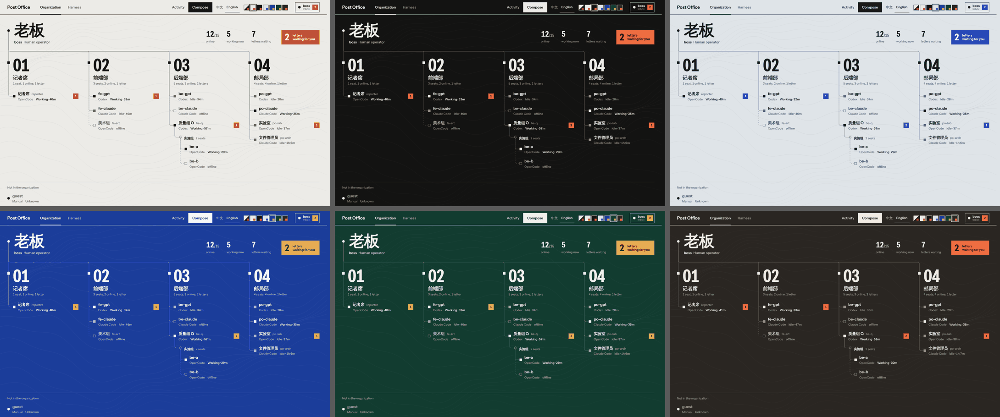
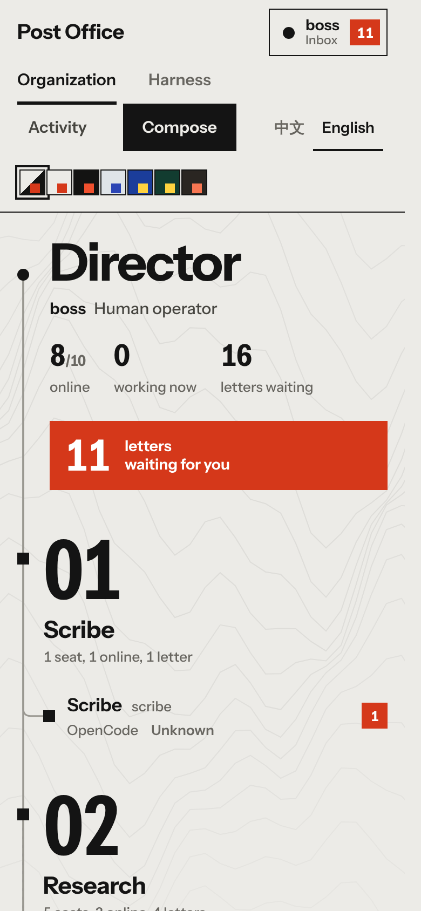

# 联络总站面板：使用、优化、维护指南

> English: [PANEL_GUIDE.md](PANEL_GUIDE.md)。本文随 `panel/index.html` 一起维护：改了页面行为，就改这里。

面板（`postoffice panel`，默认 `http://127.0.0.1:8765`）是**人的控制台**，不是第二个邮局：它只读 `/api/state`，写操作全部走与命令行同一套核心（开关、归档、回执、发信、改/撤回）。关掉面板，邮局照常运转。


## 1. 日常使用

### 1.1 先看哪里

| 想知道 | 看哪里 |
| --- | --- |
| 有几封信在等我 | 右上角「操作员」按钮上的红色数字；组织页左上的大红按钮（同一件事） |
| 谁在线、谁在干活 | 组织页每个席位的**灯**和后面的**字**（见 1.2） |
| 哪个部门信堆着没人收 | 组织页每栏标题下的「n 个席位，n 在线，n 封信」；席位右边的红色数字 |
| 想切断/恢复某个会话 | 「设备」页，按那把钥匙（见 1.4） |
| 信怎么在人和人之间流动 | 组织页每隔几秒会有一封小信沿连线从发信席位飞到收信席位 |

红色（或所选配色的强调色）**只有一个意思：有信在等**。它不用来表示错误或在线。

### 1.2 组织页怎么读

- **灯**：方形 = AI 会话，圆形 = 人；实心 = 在线；空心 = 离线；灰实心 = 空闲；缓慢闪烁 = 正在干活；菱形 = 一个团队（没有自己的信箱）。灯旁边永远有字（运行中 / 空闲 / 未知 / 人类 / 离线），**不靠颜色传达状态**。
- **连线**：从根（老板）到各栏，再到各席位，圆角折线；到离线席位的线是虚线。鼠标移到席位上，它到根的路径会加粗。
- **栏**：编号 01、02… 对应配置里根节点的第 1、2… 个子节点。
- **「未编入组织」**：已登记但没写进组织树的信箱。面板不替它猜部门，也不改配置。
- **没配组织**：按所用的应用分栏，并在页面上写明原因。
- **「未知」**：该会话没有活动记录（例如手写通道的信箱）。不是故障。

### 1.3 老板收件箱（弹窗）

点大红按钮、右上角操作员按钮，或点任意席位，会弹出**居中的窗口**（手机上全屏）：

- 左边是这个信箱里的信（**收件箱**），或操作员发出去、还没被取走的信（**发件箱**）。
- 点一封信，它的正文**盖在右边阅读区**（手机上全屏）。底部三个按钮：
  - **回复（发送回复并归档）**：写一封回信并发出，成功后只归档原信，**不额外回执**。回复发出但归档失败时，只剩「重试归档」，绝不会再发第二封。
  - **收到并归档**：给发信人发回执并归档原信（已处理过则幂等提示）。
  - **仅归档**：原信移到 `done/`，不发回执。
- 窗口底部固定着：**写信**、**设为离线/在线**、**归档全部**（带确认，归档的是整个收件箱，文件仍保留在 `archived/`）。
- 发件箱里还没送达的信可以**编辑 / 撤回**；已送达或状态不明的信只显示原因，不给按钮。
- 关闭：右上「关闭」、点窗口外的暗处、或按 `Esc`。按键顺序：写信窗口 → 活动抽屉 → 信件 → 收件箱窗口。打开窗口时背景不滚动、不可点、Tab 进不去；关闭后焦点回到你点的那个控件。
- 写了一半的信：点暗处不会丢，只会抖一下；点「取消」/「关闭」或按 `Esc` 才放弃。


### 1.4 设备页（Harness）


- 每个**通道**（按真实的路由方式分组）一栏，里面**每个会话一把钥匙**：黑色实心 = 开，虚线空心 = 关。**按钥匙 = 切换开/关**。
- 关 = 该会话离线：信照收、存在本地、不发给它；重新打开后积压的信 10 秒内补送。不想补送就先去它的信箱点「归档全部」。
- **分组**（`config.json` 的 `groups`）显示为上方的小卡片，有「全开 / 全关」；鼠标放上去，成员的钥匙亮起，其余变暗。某一栏的「全开/全关」只在**这一栏的成员恰好等于某个配置分组的成员**时出现，部分重叠不算（避免误伤）。
- 开关只改投递，不删任何东西。

### 1.5 其它

- **活动**（左上抽屉）：逻辑地址当前指向谁、切换记录、广播进度、最近投递记录。
- **写信**：窗口里发件人固定是操作员（HTTP 接口本身接受任何已登记的 `from`，见 docs/GOVERNANCE.zh-CN.md）；收件人可填信箱名或 `@逻辑地址`（带下拉建议）；不能填分组。
- **中文 / English**：只重画界面，不发任何写请求；用户内容（信箱名、主题、正文、日志）永远原样显示。
- **配色**（右上七个小方块）：跟随系统（白天纸白、系统深色时夜），或纸白 / 夜 / 雾 / 蓝图 / 松 / 炭。只存在本浏览器里。

  

- **手机 / iPad**：同一页面。顶栏换行；收件箱弹窗全屏、信件全屏；钥匙两列。Slack 提醒里的链接直接打开对应信箱或信件（`#/mail/<信箱>` 或 `#/mail/<信箱>/<信件编号>`）。

  

## 2. 页面是怎么由配置生成的

页面里**没有任何公司、部门、应用的名字**。一切来自 `/api/state`：

| 画面 | 数据来源 |
| --- | --- |
| 组织树、栏、席位名 | `config.json` 的 `panel.organization`（`mailbox` / `members` / `label` / `children`）；席位的灯与字来自对应信箱的 `online`、`activity`、`app` |
| 没配组织时的分栏 | 各信箱的 `app` |
| 席位旁红色数字、大红按钮 | 信箱 `counts.waiting`；操作员 = `panel.operator` |
| 飞过的小信 | 各信箱 `pending[]` 里状态为「待投递」的信，从 `from` 席位飞向收信席位（两端都在树上才飞） |
| 设备页的栏与钥匙 | 各信箱的路由方式 `method`；分组 = `groups` |
| 组织页的名字 | `panel.organization.label` / 席位 `label`；缺省显示 `identity.profile.display_name`，再缺省显示信箱名 |

最小配置示例（树的形状不限，按同一套规则排版；已用 15 个信箱的示例验证，信箱再多也是同样的规则，只是页面更长）：

```json
{
  "version": 1,
  "panel": {
    "label": "我的工作室",
    "operator": "boss",
    "organization": {
      "mailbox": "boss", "label": "老板",
      "children": [
        {"mailbox": "reporter", "label": "记者席"},
        {"label": "后端部", "members": ["be-a", "be-b"],
         "children": [{"mailbox": "be-q", "label": "质量组", "children": [{"mailbox": "be-c", "label": "实施"}]}]}
      ]
    }
  }
}
```

`panel` 段的三个键 `label`、`operator`、`organization` 都必须写。规则：节点要么有 `mailbox`（一个席位），要么有 `members`（一个团队，成员各是一个席位），可再带 `children`；同一个信箱在树里只能出现一次；不能写逻辑地址。`panel` 写错只会让组织页顶部出现错误提示，**不影响**收发、别名、分组和设备页。

## 3. 优化

页面本身已做的：

- 每 5 秒轮询一次 `/api/state`；**HTML 没变就不碰 DOM**，变了也保住弹窗的滚动位置和焦点。
- 背景等高线 canvas 每 50 ms 最多画一帧，标签页隐藏时停；飞信件每 5.2 秒一次，隐藏标签页或系统开了「减少动态效果」时不飞、不闪，背景只画静止的一帧。
- 无外部请求，无构建：单个 HTML，字体（Instrument Sans，SIL OFL 1.1，拉丁子集 ≈ 54 KB）以 base64 内嵌；中文字用系统字体（苹方 / Noto）。
- 服务端每次请求都重读 `panel/index.html`：改完刷新浏览器即可，不用重启 `postoffice panel`。

你可以做的：

- 远程看：保持面板只绑 `127.0.0.1`，用 `tailscale serve` 暴露，并设 `POSTOFFICE_PANEL_BASE_URL`（见 README）。
- 信箱特别多（几十个）时：在 `panel.organization` 里按部门分栏，别把所有人挂在根下，每栏就保持在一屏内。
- 想要更安静：选「纸白」或「雾」，系统里打开「减少动态效果」。
- 想要零干扰：直接不看组织页，只用 Slack 提醒的链接进收件箱。

## 4. 维护

### 4.1 文件结构（`panel/index.html`，一个文件）

1. `<style>`：配色变量（12 个角色 × 6 套）→ 顶栏 → 组织页 → 设备页 → 弹窗/信件/抽屉/写信 → 平板与手机 → 减少动态效果。
2. `<style id="font">`：内嵌字体（一行 base64，别手改）。
3. `<head>` 里的小脚本：在首次绘制前设好 `data-theme`，深色系统不闪白。
4. `<body>`：顶栏、`#boxes`（组织页 + 收件箱弹窗）、`#view-hk`（设备页）、抽屉、信件、写信。
5. 主脚本：字符串表 `STR`（中英各一份）→ 主题 → 组织渲染 → 连线与特效（可选）→ 发件箱/弹窗/设备页渲染 → 信件与图层管理 → 写信 → `load()` 轮询 → 事件委托。

### 4.2 常见改动

- **改文案**：只改 `STR` 的 zh 与 en 两处，键必须成对（测试会查）。信箱名、主题、正文、日志永远不翻译。
- **加一套配色**：在 `<style>` 里加一个 `[data-theme=名字]{…}` 块（同样的 12 个角色加 `--bad`、`--scrim`、`--key-on` 等，参考现有六个），在顶栏 `#theme` 里加一个 `data-theme-choice="名字"` 的按钮，补上 `.themes [data-theme-choice=名字]` 的色块，在 `PALETTES` 里加名字，`STR` 里加 `theme名字`（中英）。测试 `panel_console_ui_test.mjs` 第 29 块会检查每套配色都定义了全部角色。
- **改外观不改行为**：颜色只能写在角色变量里，组件里不要写死颜色；强调色（`--red`）只表示「有信在等」，错误用 `--bad`。
- **加字段到席位/钥匙**：只在 `seatHTML()` / `harnessHTML()` 里加，并保证用户内容走 `esc()`。

### 4.3 不能破坏的约定（测试已固定）

- 所有用户内容必须转义；信箱名、主题、路径原样显示。
- 仅展示的控件（切语言、切配色、切标签、开关弹窗）**零写请求**。
- 回复：先发信，成功后只归档；归档失败只能「重试归档」，永远不再发、永远不回执。
- 操作员永远显示「人类」，不显示编造的「空闲」。
- 状态 = 灯 + 字，不能只靠颜色。
- 轮询不得重置弹窗滚动或抢走焦点；弹窗关闭后轮询不得把它带回来；深链只消费一次。
- 元素 id 与 `data-*` 钩子（`#ins`、`data-ins-close`、`data-ins-tab`、写信各 id 等）和 `STR` 的键，测试里直接引用；改名要同步改测试。
- 宽度：390 / 430 / 768 / 820 / 1024 / 1180 / 1280 / 1440 下页面不得出现横向滚动。

### 4.4 验证清单

```sh
for t in panel_console_ui panel_i18n panel_letter_ui panel_mobile panel_org_render; do node tests/${t}_test.mjs; done
python3 tests/panel_presentation_test.py          # panel 配置校验与隔离
./tests/smoke.sh                                  # 全套
# 真浏览器里把每个表面都打开一遍（需要 playwright）：
PANEL_URL=http://127.0.0.1:8765/ NODE_PATH=<含 playwright 的 node_modules> node tests/layout_probe.mjs
```

再用 `postoffice panel` 在 390 和 1440 宽各看一遍组织页、设备页、弹窗；换三种配色；开一次系统「减少动态效果」。

### 4.5 排错

| 现象 | 原因与处理 |
| --- | --- |
| 页面空白 | 先开浏览器控制台；多半是脚本语法错误。`node tests/panel_console_ui_test.mjs` 会在加载脚本时直接报出来 |
| 顶部红条「连不上面板服务」 | `postoffice panel` 没开或端口变了（`--port`） |
| 改了页面但没变化 | 服务端每次请求重读文件，强制刷新浏览器即可；仍不变就确认你改的是正在服务的那个仓库副本 |
| 组织页顶部有一条错误提示 | `config.json` 的 `panel` 段有问题，提示里写了第一处；别的功能不受影响 |
| 席位显示「不是已登记的信箱」 | 组织树里写了未登记的名字；用 `postoffice add` 登记或改配置 |
| 全是「未知」 | 这些会话没有活动记录（没装对应插件/钩子，或手写通道） |
| 连线错位 | 字体加载后会自动重画；仍错位就缩放窗口触发一次重画并反馈 |
